* Table of Contents
  {:toc}

--------------------------------------------------------------------------------------------------------------------

## **Introduction**
Tracey is a desktop app for University housing committee (Hall Masters) to manage their students and premises.
Tracey is optimized for those that work well with Command Line Interface (CLI). She is equipped with Graphical User Interface (GUI) for an effective user experience.

This is a Developer Guide written to help developers get a deeper understanding of how Tracey is implemented and the reasons this project is done a certain way.
It explains the internal structure and how components in the architecture work together to allow users to command Tracey.
Our team will like to welcome you by means of allowing you admire our work.

--------------------------------------------------------------------------------------------------------------------

## **Acknowledgements**

* {list here sources of all reused/adapted ideas, code, documentation, and third-party libraries -- include links to the original source as well}

--------------------------------------------------------------------------------------------------------------------

## **Setting up, getting started**

Refer to the guide [_Setting up and getting started_](SettingUp.md).

--------------------------------------------------------------------------------------------------------------------

## **Design**

Find out more on the structure and architecture of **Tracey** in this section.

:bulb: **Tip:** The `.puml` files used to create diagrams in this document can be found in the [diagrams](https://github.com/se-edu/addressbook-level3/tree/master/docs/diagrams/) folder. Refer to the [_PlantUML Tutorial_ at se-edu/guides](https://se-education.org/guides/tutorials/plantUml.html) to learn how to create and edit diagrams.

### Architecture

The ***Architecture Diagram*** given above explains the high-level design of the App.

Given below is a quick overview of main components and how they interact with each other.

**Main components of the architecture**

**`Main`** has two classes called [`Main`](https://github.com/se-edu/addressbook-level3/tree/master/src/main/java/seedu/address/Main.java) and [`MainApp`](https://github.com/se-edu/addressbook-level3/tree/master/src/main/java/seedu/address/MainApp.java). It is responsible for,
* At app launch: Initializes the components in the correct sequence, and connects them up with each other.
* At shut down: Shuts down the components and invokes cleanup methods where necessary.

[**`Commons`**](#common-classes) represents a collection of classes used by multiple other components.

The rest of the App consists of four components.

* [**`UI`**](#ui-component): The UI of the App.
* [**`Logic`**](#logic-component): The command executor.
* [**`Model`**](#model-component): Holds the data of the App in memory.
* [**`Storage`**](#storage-component): Reads data from, and writes data to, the hard disk.

**How the architecture components interact with each other**

The *Sequence Diagram* below shows how the components interact with each other for the scenario where the user issues the command `delete 1`.

Each of the four main components (also shown in the diagram above),

* defines its *API* in an `interface` with the same name as the Component.
* implements its functionality using a concrete `{Component Name}Manager` class (which follows the corresponding API `interface` mentioned in the previous point.

For example, the `Logic` component defines its API in the `Logic.java` interface and implements its functionality using the `LogicManager.java` class which follows the `Logic` interface. Other components interact with a given component through its interface rather than the concrete class (reason: to prevent outside component's being coupled to the implementation of a component), as illustrated in the (partial) class diagram below.

The sections below give more details of each component.

### UI component

The structure of the UI component will be explained here.

The **API** of this component is specified in [`Ui.java`](https://github.com/se-edu/addressbook-level3/tree/master/src/main/java/seedu/address/ui/Ui.java)

The UI consists of a `MainWindow` that is made up of parts e.g.`CommandBox`, `ResultDisplay`, `PersonListPanel`, `StatusBarFooter` etc. All these, including the `MainWindow`, inherit from the abstract `UiPart` class which captures the commonalities between classes that represent parts of the visible GUI.

The `UI` component uses the JavaFx UI framework. The layout of these UI parts are defined in matching `.fxml` files that are in the `src/main/resources/view` folder. For example, the layout of the [`MainWindow`](https://github.com/se-edu/addressbook-level3/tree/master/src/main/java/seedu/address/ui/MainWindow.java) is specified in [`MainWindow.fxml`](https://github.com/se-edu/addressbook-level3/tree/master/src/main/resources/view/MainWindow.fxml)

The `UI` component,

* executes user commands using the `Logic` component.
* listens for changes to `Model` data so that the UI can be updated with the modified data.
* keeps a reference to the `Logic` component, because the `UI` relies on the `Logic` to execute commands.
* depends on some classes in the `Model` component, as it displays `Person` object residing in the `Model`.

### Logic component

The structure of the Logic component will be explained here.

**API** : [`Logic.java`](https://github.com/se-edu/addressbook-level3/tree/master/src/main/java/seedu/address/logic/Logic.java)

Here's a (partial) class diagram of the `Logic` component:

How the `Logic` component works:
1. When `Logic` is called upon to execute a command, it uses the `AddressBookParser` class to parse the user command.
2. This results in a `Command` object (more precisely, an object of one of its subclasses e.g., `AddCommand`) which is executed by the `LogicManager`.
3. The command can communicate with the `Model` when it is executed (e.g. to add a person).
4. The result of the command execution is encapsulated as a `CommandResult` object which is returned back from `Logic`.

The Sequence Diagram below illustrates the interactions within the `Logic` component for the `execute("delete 1")` API call.

:information_source: **Note:** The lifeline for `DeleteCommandParser` should end at the destroy marker (X) but due to a limitation of PlantUML, the lifeline reaches the end of diagram.

Here are the other classes in `Logic` (omitted from the class diagram above) that are used for parsing a user command:

How the parsing works:
* When called upon to parse a user command, the `AddressBookParser` class creates an `XYZCommandParser` (`XYZ` is a placeholder for the specific command name e.g., `AddCommandParser`) which uses the other classes shown above to parse the user command and create a `XYZCommand` object (e.g., `AddCommand`) which the `AddressBookParser` returns back as a `Command` object.
* All `XYZCommandParser` classes (e.g., `AddCommandParser`, `DeleteCommandParser`, ...) inherit from the `Parser` interface so that they can be treated similarly where possible e.g, during testing.

### Model component

The structure of the Model component will be explained here.

**API** : [`Model.java`](https://github.com/se-edu/addressbook-level3/tree/master/src/main/java/seedu/address/model/Model.java)

The `Model` component,

* stores the address book data i.e., all `Person` objects (which are contained in a `UniquePersonList` object).
* stores the currently 'selected' `Person` objects (e.g., results of a search query) as a separate _filtered_ list which is exposed to outsiders as an unmodifiable `ObservableList<Person>` that can be 'observed' e.g. the UI can be bound to this list so that the UI automatically updates when the data in the list change.
* stores a `UserPref` object that represents the user’s preferences. This is exposed to the outside as a `ReadOnlyUserPref` objects.
* does not depend on any of the other three components (as the `Model` represents data entities of the domain, they should make sense on their own without depending on other components)

:information_source: **Note:** An alternative (arguably, a more OOP) model is given below. It has a `Tag` list in the `AddressBook`, which `Person` references. This allows `AddressBook` to only require one `Tag` object per unique tag, instead of each `Person` needing their own `Tag` objects. 

### Storage component

The structure of the Storage component will be explained here.

**API** : [`Storage.java`](https://github.com/se-edu/addressbook-level3/tree/master/src/main/java/seedu/address/storage/Storage.java)

The `Storage` component,
* can save both address book data and user preference data in json format, and read them back into corresponding objects.
* inherits from both `AddressBookStorage` and `UserPrefStorage`, which means it can be treated as either one (if only the functionality of only one is needed).
* depends on some classes in the `Model` component (because the `Storage` component's job is to save/retrieve objects that belong to the `Model`)

### Common classes

Classes used by multiple components are in the `seedu.addressbook.commons` package.

--------------------------------------------------------------------------------------------------------------------

## **Implementation**

This section describes some noteworthy details on how certain features are implemented.

### Tracking feature

#### Current Implementation
Currently, **Tracey** helps with 9 different types of command:
1. `add student`
2. `edit student data`
3. `delete student`
4. `find student`
5. `filter statuses`
6. `summarise all data`
7. `help user`
8. `list all data`
9. `clear all data`

This 9 features allow users of **Tracey** to be able to manage the covid situation in the hall.
All 9 features extends from the `abstract` `Command` class.   

The table below summarises the 15 different tracking commands:

| Command                        | Command Word | Purpose                                                               |
|--------------------------------|--------------|-----------------------------------------------------------------------|
| `add student`                  | `add`        | Adds a new student profile.                                           |
| `edit student data`            | `edit`       | Edits an existing student.                                            |
| `delete student`               | `delete`     | Delete an existing student.                                           |
| `find student`                 | `find`       | Find an existing student.                                             |
| `filter statuses`              | `filter`     | Filter out a list of students by covid status.                        |
| `summarise all data`           | `summarise`  | Make pie charts out of the data.                                      |
| `help user`                    | `help`       | Provide a how-to-use on this app.                                     |
| `list all data`                | `list`       | List out all students in Tracey.                                      |
| `clear all data`               | `clear`      | Empty the database.                                                   |
| `show email`                   | `email`      | Open email window to copy list of emails.                             |
| `resize result display window` | `resize`     | Resize the result display window based on options with pre-set sizes. |
| `archive database`             | `archive`    | Saves a copy of the working database for archival purposes.           |
| `undo command`                 | `undo`       | Undoes the previous command.                                          |
| `redo command`                 | `redo`       | Redoes the previous command that was undone.                          |
| `import excel file`            | `import`      | Import data from an exisitng excel file.                              |

### Add feature

The add mechanism implements the following sequence and interactions for the method call execute("add NEW_PERSON_TAGS") on a LogicManager object where NEW_PERSON_TAGS refers to the tags of a person to be added.

The original AB3 implementation of the add feature only had a selected general few tags to be used (name, email, address, phone, email). To address our target users for this application, we added the tags block, faculty, matriculation number and covid status.

In order to accommodate this new fields, we added new attributes into the `Person` Class and also created `Block`, `Faculty`, `MatriculationNumber` and `CovidStatus` classes.

This also required changes to `CLISyntax` to include the new prefixes for the added classes.

**Path Execution of Add Feature Activity Diagram is shown below:**
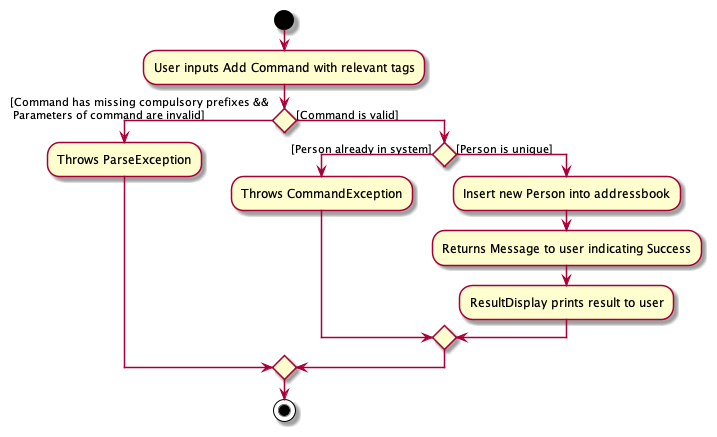

Modelling the workflow of the `Add` Command, when the user inputs an **Add Command**, the command is checked if the required prefixes are present **and** the parameters of the command are valid. If not valid, a **ParseException** will be thrown. If valid, the parameters are then checked for uniqueness. If it is a duplicate `Person` object, a **CommandException** is thrown. Else, a new `Person` object is created and added to `AddressBook`. Subsequently, the result is printed out to the User.

**Class Diagram of Add Feature is shown below:**
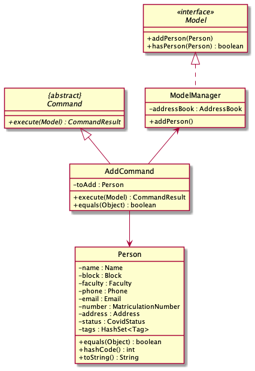

Additionally, there are a few final static messages to be displayed to the user for various scenarios when utilising the AddCommand:

1. `MESSAGE_SUCCESS`:
    - Scenario: Adding of the specified `Person` to the database is successful.
    - Message: "New person added: %1$s" where "%1$s" is the added person's details.
2. `MESSAGE_DUPLICATE_PERSON`:
    - Scenario: Specified `Person` already exists in the database due to conflicting `MatriculationNumber`, `Phone` or `Email`.
    - Message: "This person's %s already exists in the address book" where "%s" refers to the unique fields: `Phone`, `Matriculation Number`, `Email`.

**Sequence Diagram of Add Feature is shown below:**

:information_source: **Note:** The lifeline for `AddCommand` should end at the destroy marker (X) but due to a limitation of PlantUML, the lifeline reaches the end of diagram.

:information_source: **Note** Replace `NEW_PERSON_TAGS` in the sequence diagram with the tags stated in the notes shown in the sequence diagram.

When a user inputs an add command, the `execute()` method of `LogicManager` will be called and this will trigger a parsing process by `AddressBookParser`, `AddCommandParser` and `ParserUtil` to check the validity of the input prefixes and parameters. If the input is valid, a `Person` object is instantiated and this object is subsequently used as a parameter to instantiate an `AddCommand` object.

Following this, `LogicManager` will call the `execute()` method of the `AddCommand` object. In this method, the `hasPerson()` method of the `Model` class will be called, checking to see if this person exists in the database. If the person exists, a **CommandException** is thrown. Else, the `addPerson()` method of the `model` is called. Finally, it returns a new `CommandResult` object containing a string that indicates success of Add Command.

### Summarise feature

The summarise mechanism implements the following sequence and interactions for the method call execute("summarise").

#### What is the summarise feature

The summarise feature allows users to visualise the statistics of students in the Hall by their covid status and their faculty/block.
Firstly, Tracey will calculate how many positive cases are there in total. She will then calculate how many are positive, negative and on HRN in each block. She will then do the same with the students' faculties.
Data on each block and faculties will be drawn as pie charts and bar chart on a separate window.

This is helpful to determine if there is a specific block or faculty facing a covid superspread. Hall masters and leaders can be more certain on their follow-up actions to keep
their hall safe. This feature is unique from the List feature due to its additional computational ability to make better sense out of the data in Tracey.

The `summarise` command is as follows:

`summarise`

The user can choose when to execute the summarise command.

**Path Execution of Summarise Feature Activity Diagram is shown below:**
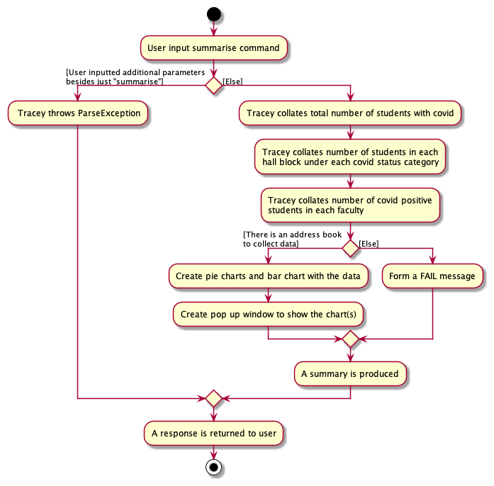

There are three possible execution paths for this command.
1. User inputs `summarise` command with students' records stored in Tracey. After the Pie Chart Window opens, the user can scroll through the window to see the pie charts for each block followed by the bar chart categorised by faculty.
2. User inputs `summarise` command with no students' records stored in Tracey. Tracey will just respond that there is no students to summarise. The Pie Chart Window will not open.
3. User inputs `summarise` command with additional parameters. Tracey will throw a **ParseException** to indicate that the format of the summarise input is wrong.

**Class Diagram of Summarise Feature is shown below:**

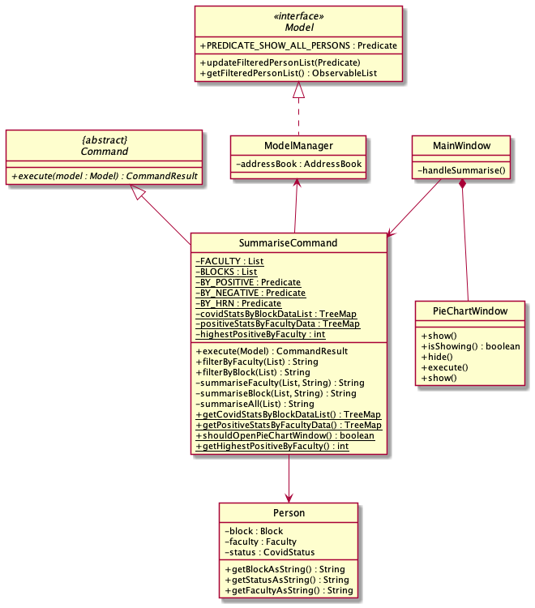

The above class diagram shows the structure of the Summarise Command and its associated classes and interfaces.

**Sequence Diagram of Summarise Feature is shown below:**

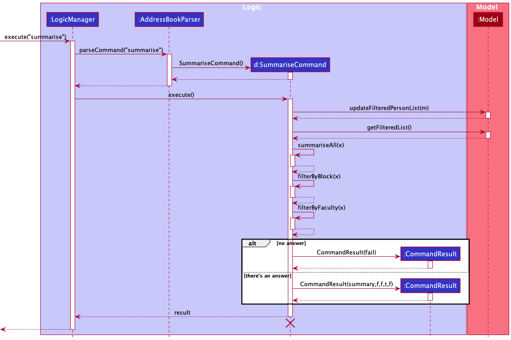

:information_source: **Note:** The lifeline for `SummariseCommand` should end at the destroy marker (X) but due to a limitation of PlantUML, the lifeline reaches the end of diagram.

The sequence diagram below shows the interactions between objects during the execution of a `summarise` command.

When execute is called on the SummariseCommand object, there are multiple call back to self to anaylse and produce the result back to the Logic Manager.

When a user inputs a summarise command, the `execute()` method of `LogicManager` will be called and this will trigger a parsing process by `AddressBookParser`.
If the input is valid, an `SummariseCommand` object will be instantiated. If the input is invalid with additional parameters beside `summarise`, an exception will be thrown.

Following the valid input, `Logic Manager` will call the `execute()` method of the `SummariseCommand` object. In this method,
the `updatedFilteredPersonList` method and `getFilteredPersonList` method of the `Model` class will be called, making sure the list of students are displayed on the UI.
After getting the list of students, the `SummariseCommand` object will call its own `summariseAll` method to generate a message regarding total number
of covid cases in that hall. Then, `filterByBlock` method is then called on the same list again to organise the students into separate lists according to their block.
`filterByBlock` will call on its own `summariseBlock` method to generate statistics of covid statuses in each block of the hall. The statistics will be stored in `covidStatsByBlockDataList`.
`filerByFaculty` is then called on the list once again to organise the students into separate lists according to their faculty.
`summariseFaculty` method is then called to generate statistics of covid statuses in each faculty of students in the hall. The statistics will be stored in `positiveStatsByFacultyData`.
At the same time, `summariseFaculty` will stored the highest number of covid cases amongst the faculties in `highestPositiveByFaculty`.

Finally, it returns a new `CommandResult` object containing a string that indicates either failure or success of Summarise Command.
A pop up window with the pie charts aligned to the message response will be generated to aid in the visualisation of data.

### Pie Chart Window feature

The pie chart window mechanism implements the following sequence and interactions for the method call execute("summarise").

#### What is the Pie Chart Window feature

Pie Chart Window feature opens up a separate window that contains charts for the user to view.
The window contains pie charts that summarises how each block is doing according to the types of covid statuses and a bar chart that
summarises how many covid positive students each faculty has in the hall. 

**Class Diagram of Pie Chart Window Feature is shown below:**

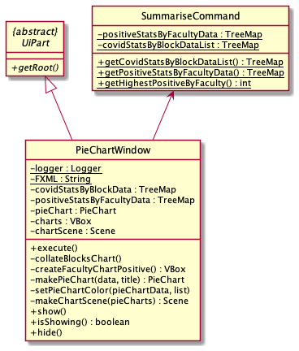

The above class diagram shows the structure of the Pie Chart Window and its associated classes and interfaces.
The Pie Chart Window has dependencies on the UiPart class as it uses the method `UiPart#getRoot()` from it to make the window.

**Sequence Diagram of Pie Chart Window Feature is shown below:**

This feature is implemented using a new class `PieChartWindow` and modifications to `SummariseCommand` and `MainWindow`.
When the user inputs `SummariseCommand`, `SummariseCommand#summariseFaculty()` and `SummariseCommand#summariseBlock()` will
be invoked and puts the necessary data into a `TreeMap` that is a static variable of `SummariseCommand`. In `MainWindow#executeCommand()`,
it will invoke `MainWindow#handleSummarise()` which first check whether the pie chart window is to be displayed by calling `SummariseCommand#shouldOpenPieChartWindow()`.
If true and the window is already opened previously by the user, `MainWindow#handleSummarise()` will call `PieChartWindow#hide()` to close the window.
Regardless, `MainWindow#handleSummarise()` will call `PieChartWindow#execute()` to create the pie chart and opens a new window.
The data needed for the pie chart is obtained using `SummariseCommand#getPositiveStatsByFacultyData()` and `SummariseCommand#getCovidStatsByBlockDataList()`.

Below are links for implementation of the classes and its methods:
* [`PieChartWindow`](../src/main/java/seedu/address/ui/PieChartWindow.java)
* [`SummariseCommand`](../src/main/java/seedu/address/logic/commands/SummariseCommand.java)
* [`MainWindow`](../src/main/java/seedu/address/ui/MainWindow.java)

#### <ins>Why it is implemented that way<ins/>
The data needed for the pie charts should be coupled with `SummariseCommand`, therefore it is necessary to implement this feature in such a way that the pie chart data is created upon invocation `SummariseCommand`. A `PieChartWindow` controller and FXML class is also needed to abstract the creation of the pie charts and opening a new window respectively. The `MainWindow` class is then modified accordingly.

#### <ins>Alternatives considered<ins/>

**Aspect: How data is passed to the pie charts:**

* **Alternative 1 (current choice):** `SummariseCommand` will pass in necessary data into data structures (`TreeMap` in this case) upon invocation which then can be obtained using getter methods
    * Pros: Easy to implement.
    * Cons: Dependent on the `SummariseCommand` class to pass in correct inputs.
    * Other consideration(s): Use the Singleton design principle for the data structures.

* **Alternative 2:** Parse the feedback to user message from `SummariseCommand`
    * Pros: No modifications to the `SummariseCommand` class.
    * Cons: Dependent on the feedback message, need to implement complicated methods to parse the message, parsing methods need to be modified if the format of the feedback message is changed.

### Help feature

The help mechanism implements the following sequence for the method call execute("help").

What is the help feature

The help feature opens up a separate window that contains a simple user guide for the user to adhere to. The window contains a list of commands that Tracey provides, their formats and examples.
When the Help Window is open, the user can also choose to view the comprehensive user guide on the user's default browser by clicking on the `Open User Guide` button.

The `help` command is as follows:

`help`

The user can choose when to execute the `help` command.

The activity diagram shows the possible execution paths for the `help` command.

**Path Execution of Help Feature Activity Diagram is shown below:**

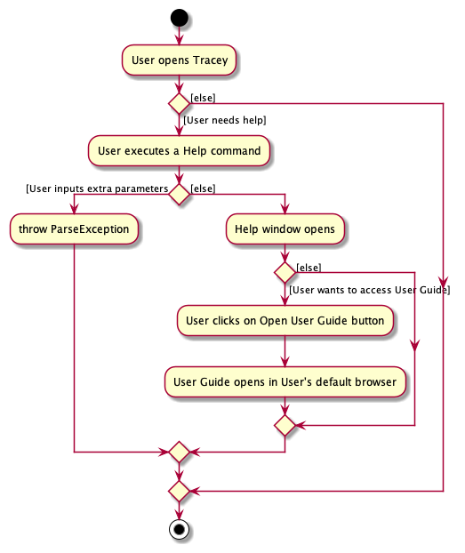

**Class Diagram of Help Feature is shown below:**

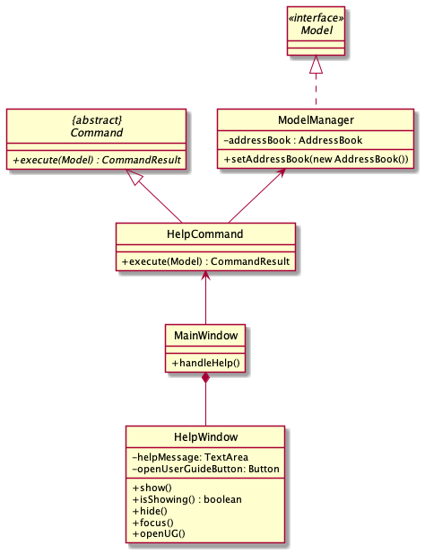

**Sequence Diagram of Help Feature is shown below:**

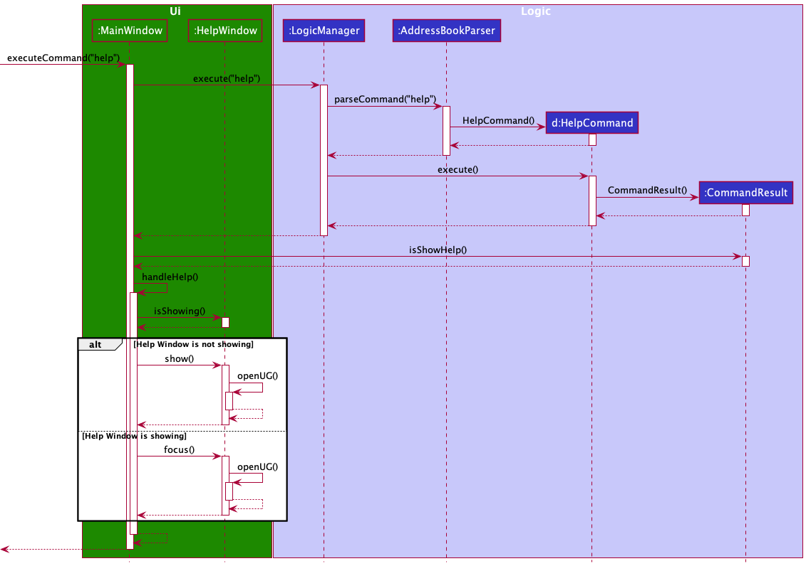

### Clear feature

The clear mechanism implements the following sequence and interactions for the method call execute("clear") on a LogicManager object.

The original AB3 implementation of the clear feature acts a similar way to how we clear the address list. This clear feature allows
user to replace the list of students with an empty one. Previous data are swiped away.

**Path Execution of Clear Feature Activity Diagram is shown below:**

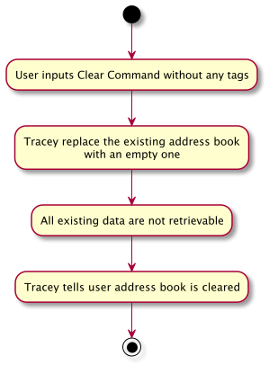

**Class Diagram of Clear Feature is shown below:**
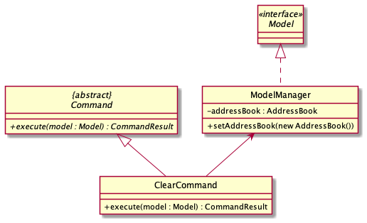

Additionally, there is a static final static message to be displayed to the user when utilising the Clear Command:

1. `MESSAGE_SUCCESS`
    - Scenario: Tracey database successfully cleared.
    - Message: "Tracey has been cleared!".

**Sequence Diagram of Clear Feature is shown below:**

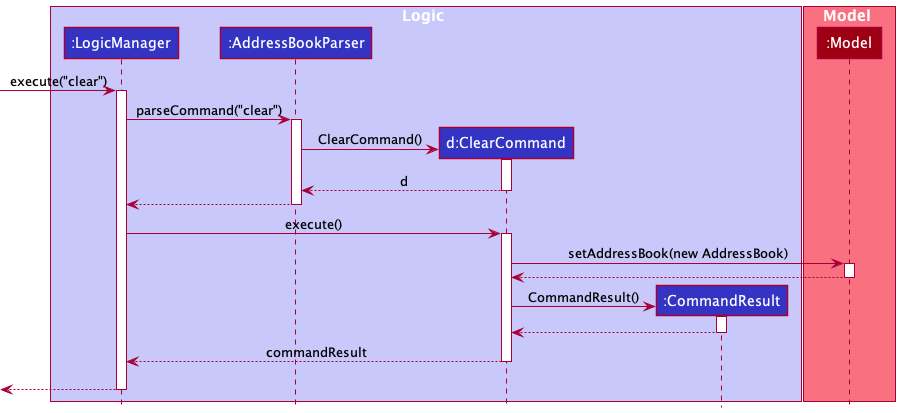

 

### Find feature

The find mechanism implements the following sequence for the method call execute("find").

#### What is the find feature

The find feature allows users to find a particular contact by its name in Tracey and retrieve their specific details.

The `find` command is as follows:

`find NAME`

The user do not require to search the full name of the contact. However,  the query substring must match the person's
starting from the first character.

e.g. `find J`
This will return any contact details starts with J in the Tracey.

e.g. `find Ja`
This will match `Jack` while `find ck` will not match.

The activity diagram shows the possible execution paths for the `find` command.

**Path Execution of Find Feature Activity Diagram is shown below:**

There are two possible execution paths for this command.

1. User input the `find` command with invalid or empty arguments. A CommandException will be thrown, and Tracey will
   display an error message that informs the contact details the user try to search is not found.

2. User input the `find` command with valid arguments. Tracey returns a list of contact details that matches the
   input name from the existing database, and display the contact list to the user.

The sequence diagram below illustrates the execution of `find` command.

**Sequence Diagram of Find Feature is shown below:**
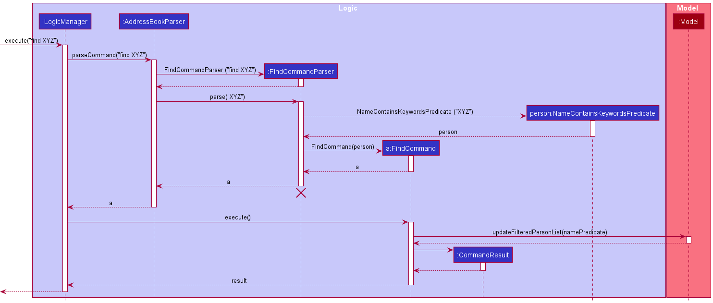

The argument typed into Tracey's text box will first be taken in by the `execute` method in `LogicManager`. It will
then be parsed by the `parseCommand` function in the `AddressBookParser` object.

A `FindCommandParser` object will then be created to parse this input, with its `parse` function. A
NameContainsKeywordsPredicate object is then created, containing the name that the user has entered.
This NameContainsKeywordsPredicate object is then used to create a FindCommand object.

Subsequently, the `parseCommand` method in `LogicManager` will continute to create a `CommandResult`, displaying
a success message and a list of the students that match up the name.

 

### Edit feature

In this section, the functionality of the `edit` feature, the expected execution path, the structure of the **EditCommand** class and the interactions between objects with the **EditCommand** object will be discussed.

#### What is the edit feature

The edit feature allows the user to edit field values of exising student with new values.

The `edit` command is as follows:

`edit [INDEX] [PREFIX/NEW_VALUE]...` where `[PREFIX/NEW_VALUE]...` indicates one or more new fields in which the user wishes to edit.

The original AB3 implementation of this feature allows editing fields without making any new changes on the `Person`. e.g. If a `Person` with `name` of  John (indexed 1) is already present in the address book, then the command `edit 1 n/John` will still work. 
In addition, for attribute types that need to be unique for each `Person` e.g. `Phone`, `Email` and `Matriculation Number`, the edited value for these unique attribute types still work even if it already exists in Tracey.
 e.g. Given the two following `Person` objects in Tracey:
* `name`: John `Email`: john123@gmail.com (indexed 1)
* `name`: Johnny `Email` johnny123@gmail.com (indexed 2)

The original AB3 implementation of this feature allows the same edited value for the corresponding field of the person. `e.g` If a `Person` with `name` of  John (index 1 in the address book) is already present in the address book, then the command `edit 1 n/John` will still work.
In addition, for attribute types that need to be unique for each `Person` `e.g.``Phone`, `Email` and `Matriculation Number`, the edited value for these unique attribute types still work even if it already exists in the address book.
 `e.g.` If there are two `Person`:
* `name`: John `Email`: john123@gmail.com (Index 1 in the address book)
* `name`: Johnny `Email` johnny123@gmail.com (Index 2 in the address book)
    The command `edit 2 e/john123@gmail.com` still works and the new `Email` value for Johnny would be updated to `john123@gmail.com` even though this email already exists in the address book for John and is supposed to be unique for each person in the address book.

In order to address these issues, we have enhanced the `EditCommand` to include `EditCommand#editChecker()` to address the former issue and and `Person#isDifferentPerson()` to address the latter issue.

####**Path Execution of Edit Feature Activity Diagram is shown below:**
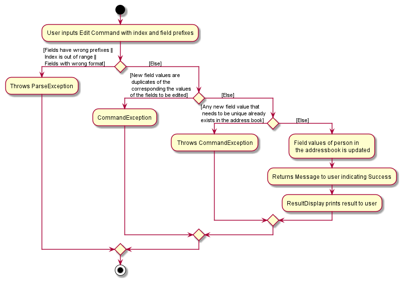

**Class Diagram of Edit Feature is shown below**

The class diagram above depicts the structure of `EditCommand`. As per any `Command` class, `EditCommand` needs to extend the abstract class `Command`.

Modelling the workflow of the `Edit` Command, when the user inputs an **Edit Command**, the command is checked if the required prefixes are correct, the index is not out of range **and** fields are of the correct format. If the requirements are not met, a **ParseException**
will be thrown, else the new field values are then checked against its corresponding field values to be edited for duplicates. If there are any duplicates, a **Command Exception** will be thrown, else the new values that required uniqueness (`e.g.` `Phone``Email` `Matriculation Number`) are checked against the address book
for if it already exists. If it does, a **Command Exception** will be thrown, else the field values to be edited are updated with the new field values as a success message would be shown to the user.
  
####**Class Diagram of Edit Feature is shown below**

The class diagram above depicts the structure of `EditCommand`. As per any `Command` class, `EditCommand` needs to extend the abstract class `Command`.

Additionally, there are a few final static messages to be displayed to the user for various scenarios when utilising the **EditCommand**:
1.`MESSAGE_EDIT_PERSON_SUCCESS`:
  - Scenario: Editing of the attribute(s) of the specified `Person` in the database is successful.
  - Message: "Edited Person: %1$s" where %1$s refers to the updated details of the `Person`.
2. `MESSAGE_NOT_EDITED`:
  - Scenario: No attribute is specified for the `Person` to be edited.
  - Message: "At least one field to edit must be provided."
3. `MESSAGE_DUPLICATE_PERSON`:
  - Scenario: New values used for attribute(s) that requires uniqueness e.g. `Phone` `Email` `Matriculation Number` already exists in the database.
  - Message: "This person already exists in the address book."
4. `MESSAGE_SAME_INPUT`:
  - Scenario: New values used for attribute(s) is duplicates of the corresponding attribute(s) to be edited.
  - Message: "The edited value is the same as the current one."
  
####**Sequence Diagram of Edit Feature is shown below:**
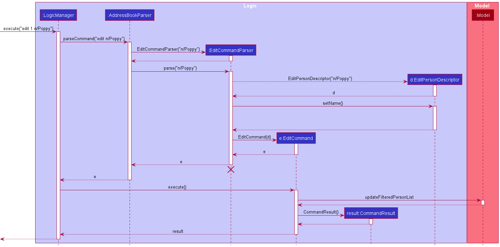

:information_source: **Note:** The lifeline for `EditCommand` should end at the destroy marker (X) but due to limitation of PlantUML, the lifeline reaches the end of diagram.

The above figure illustrates the important interactions of `EditCommand` when the user successfully edit the `name` attribute of the student at index 1 to Poppy.

When a user inputs an `EditCommand`, `LogicManager#execute()` will be invoked and this will trigger a parsing process by `AddressBookParser`, `EditCommandParser` and `ParserUtil` to check the validity of the input index, prefixes and parameters. If the input is valid, a `EditPersonDescriptor` object is instantiated and this object is subsequently used as a parameter to instantiate an `EditCommand` object.
The `EditCommand` object is then passed back to the `LogicManager` which will then invoked `EditCommand#execute()`. This execute method will call two other helper methods `EditCommand#editChecker()` and `Person#isDifferentPerson()`, which both are not shown in the sequence diagram and is used further validation.
The main functions of these two methods are to check if the new values are duplicate of the corresponding fields to be edited and if the new values for fields that requires uniqueness already exists in the address book respectively.
The `ObservableList` in the `Model` class then updates the display of the contacts, placing the edited person to the bottom of the list (or placing it at the last index).

TThe `ObservableList` is a JavaFX class which observes and automatically changes the list once an update is performed.

###Import feature

The import mechanism implements the following sequence for the method call execute("import").

#### What is the import feature

The import feature allows users to import an Excel file that contains a list of student records into Tracey.

The `import` command is as follows:

`import FILE PATH`

The activity diagram shows the possible execution paths for the `import` command.

**Path Execution of Import Feature Activity Diagram is shown below:**

There are two possible execution paths for this command.

1. User inputs the `import` command with invalid or empty arguments. A ParseException will be thrown, and Tracey will display an error message along with the correct input format to the user.
2. User inputs the `import` command with valid arguments. Tracey then stores the specified filter criteria, and displays a list based on those criteria.

The sequence diagram below shows the interactions between objects during the execution of a `import` command.

**Sequence Diagram of Import Feature is shown below:**

### Filter feature

In this section, the functionality of the filter feature, the expected execution path, the structure of the FilterCommand class, the structure of the FilterCommand class and the interactions between objects with the FilterCommand object will be discussed.

#### What is the filter feature

The filter feature allows users to retrieve a list of specific students, filtering them by covid status, and/or faculty, and/or block.

#### Path execution of filter feature

The `filter` command is as follows:

`filter cs/[COVID STATUS] f/[FACULTY] b/[BLOCK]`

The user can choose whether to input filter criteria for some or all of the fields. However, at least one field must be specified.  

The user can thus choose different combinations of filter criteria depending on the motive. For example, if a block head wants to cater to the covid-positive students in a certain block, the user can simply filter by both covid status and block to find out the details of this group of people.

eg.
`filter cs/positive f/soc`  
This is still a valid input even though the filter criteria for block was not specified. The resultant list will contain students who are both covid-positive and from the faculty "SOC".

The activity diagram shows the possible execution paths for the `filter` command.

**Path Execution of Filter Feature Activity Diagram is shown below:**

There are two possible execution paths for this command.

1. User inputs the `filter` command with invalid or empty arguments. A ParseException will be thrown, and Tracey will display an error message along with the correct input format to the user.
2. User inputs the `filter` command with valid arguments. Tracey then stores the specified filter criteria, and displays a list based on those criteria.

#### Structure of Filter feature

The following is a class diagram of the filter feature. 

**Class diagram of Filter feature is shown below:**

The above class diagram shows the structure of the FilterCommand and its associated classes and interfaces. Some methods and fields are not included because they are not extensively utilised in FilterCommand; such as public static fields and getter/setter methods.

#### Interaction between objects when the Filter Command is executed

The sequence diagram below shows the interactions between objects during the execution of a `filter` command.

**Sequence Diagram of Filter Feature is shown below:**

The arguments typed into Tracey's text box will first be taken in by the `execute` method in `LogicManager`. It will then be parsed by the `parseCommmand` function in the `AddressBookParser` object.

A `FilterCommandParser` object will then be created to parse this input, with its `parse` function. A `FilterDescriptor` object is then created, containing the filter criteria that the user has entered. This `FilterDescriptor` object is then used to create a `FilterCommand` object.

Subsequently, the `parseCommand` method in `LogicManager` will continue to create a `CommandResult`, displaying a success message and a list of the filtered students.

The `ArgumentMultimap` class is used to parse the user input and store the filtering criteria, based on the respective prefixes of the different fields. This was used so that the input criteria of each field can be taken from the user input irregardless of the order that they typed it in.
The `FilterDescriptor` takes in the filter criteria and returns a single predicate encompassing all the criteria on its `getFilters` method, so that this predicate can be used as an argument for the `updateFilteredPersonsList` method of the `Model` object, displaying a list of students that were filtered by this predicate.

### Email Feature

The email mechanism implements the following sequence for the method call execute("email").

#### What is the email feature

The email feature opens up a separate window containing the emails of the students found in the current list displayed. The email feature allows a user to copy the email list to their clipboard to paste in their email platform of choice.

The `email` command is as follows:

`email`

The user can choose when to execute the email command.

The activity diagram shows the possible execution paths for the `email` command.

**Path Execution of Email Feature Activity Diagram is shown below:**

There are two possible execution paths for this command.
1. User inputs `email` command. After the Email Window opens, the user can choose copy the emails in the list by clicking on the copy email button. After which, the user can close the Email Window.
2. User inputs `email` command. After the Email Window opens, the user chooses not to copy the emails in the list. After which, the user can close the Email Window.

The sequence diagram below shows the interactions between objects during the execution of a `email` command.
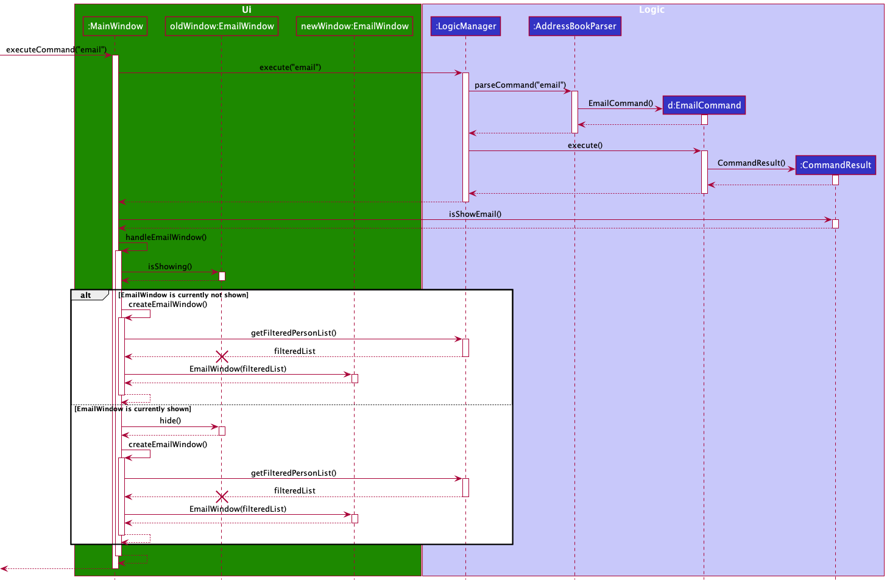

When a user inputs an email command into the Tracey, the `executeCommand()` method of `MainWindow` will be called and this will call the `execute()` method of `LogicManager`. This will trigger a parsing process by `AddressBookParser`,  which then instantiates an `EmailCommand` object.

Following this, the `LogicManager` will call the `execute()` method of the `EmailCommand` object. In this method, a `CommandResult` object will be instantiated.

Back in the `MainWindow`'s `executeCommand()` method, it will then call the `handleEmailWindow()` method which will then instantiate an `EmailWindow` object.

Afterwards, the `LogicManager` calls the `show()` method of `EmailWindow` and the `EmailWindow` will be shown to the user.

### Exit Feature

The exit mechanism implements the following sequence for the method call execute("exit").

#### What is the exit feature

The exit feature allows users to exit from Tracey after they finish with it.

The `exit` command is as follows:

`exit`

The user can choose when to exit the programme  

The activity diagram shows the possible execution paths for the `exit` command.

**Path Execution of Exit Feature Activity Diagram is shown below:**

There is one possible execution path for this command.

1. User inputs the `exit` command, triggering Tracey to close its programme

The sequence diagram below shows the interactions between objects during the execution of a `exit` command.

**Sequence Diagram of Exit Feature is shown below:**

### Undo/Redo features

In this section, the functionality of the undo and redo features, the expected execution path, the structure of the UndoCommand and RedoCommand class, and the interactions between objects with the UndoCommand and RedoCommand objects will be discussed.

#### What are the undo and redo features

The undo feature allows users reverse an `add`, `edit`, or `delete` command.

The redo feature allows users to reverse an `undo` command. 

#### Execution of undo feature

The `undo` command is as follows:

`undo`

Calling this command undoes only the last executed add, edit or delete command, and can only be used after executing an add, edit, or delete command.

This command cannot be used in succession to undo previously executed commands besides the last executed one.

#### Execution of redo feature

The `redo` command is as follows:

`redo`

Calling this command reverses only the last executed undo command, and can only be used after executing an undo command.

This command cannot be used in succession.

### Path execution of undo and redo features

The activity diagram shows the possible execution paths for the `undo` and `redo` command.

**Path Execution of Undo and Redo Features Activity Diagram is shown below:**
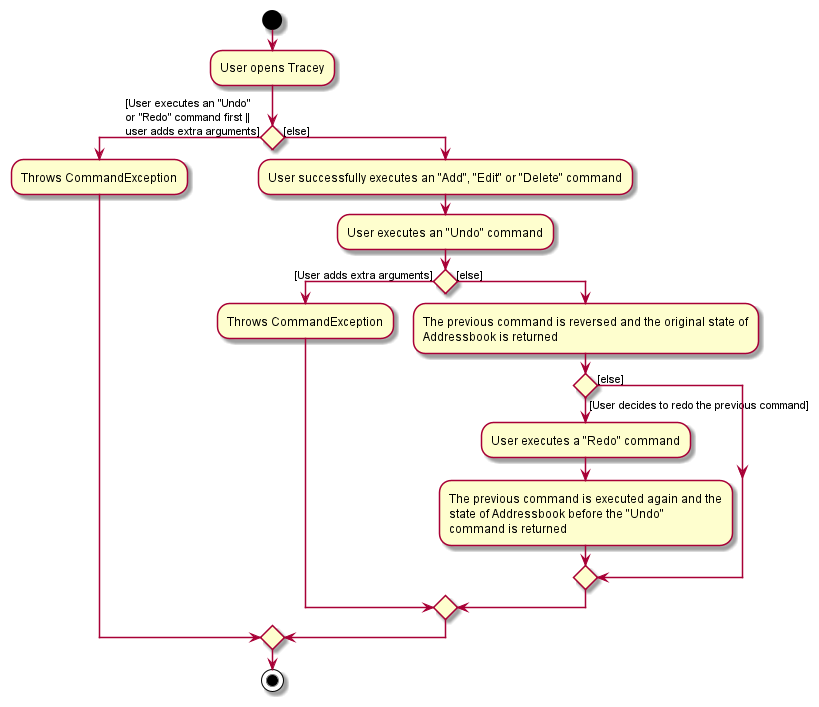

#### Implementation

The proposed undo/redo mechanism is facilitated by `AddressBook`. On top of the current state of the `UniquePersonList` of `Person` objects, it stores two additional states, the history and the "original" state. Additionally, it implements the following operations:

* `AddressBook#saveHistory()` — Saves the current persons list state in its history.
* `AddressBook#restoreHistory()` — Restores the previous state of the persons list from its history and deletes the history.
* `AddressBook#saveOriginal()` — Saves the current persons list state in an "original" state, used after an `undo` command is called.
* `AddressBook#restoreOriginal()` — Restores the previous state of the persons list from its "original" state and deletes the history.

The restoreHistory() and restoreOriginal() operations are exposed in the `Model` interface as `Model#restoreHistory()` and `Model#restoreOriginal()` respectively.

Given below is an example usage scenario and how the undo/redo mechanism behaves at each step.

Step 1. The user launches the application for the first time. The `AddressBook` will be initialized with only the current state (state A) of the list of `Person` objects as `persons`. 

Step 2. The user executes `delete 5` command to delete the 5th person in the address book, modifying `persons` (now having a state B). The `delete` command calls `Model#saveHistory()`, causing the modified state of the address book before the `delete 5` command executes to be saved in the `personsHistory`.

Step 3. The user now decides that deleting the person was a mistake, and decides to undo that action by executing the `undo` command. The `undo` command will call `Model#restoreHistory()`, which will replace the current state of `persons` with state A in `personsHistory`.

The original list with the person at index 5 deleted, shown as state B, will be stored in `personsOriginal` and `personsHistory` will be set to null.

Step 4. The user then decides that the initial delete was not a mistake, and decides to redo that action by executing the `redo` command. The `redo` command will call `Model#restoreOriginal()`, which will replace the current state of `persons` with state B in `personsOriginal`.

`personsOriginal` will then be set to null.

:information_source: **Note:** If `undo` is called as the first command or in succession, `personsHistory` will be null. The `undo` command uses `Model#checkHistory()` to check if this is the case. If so, it will return an error to the user rather
than attempting to perform the undo. Similarly, if `redo` is called as the first command or in succession, `personsOriginal` will be null. The `redo` command uses `Model#checkOriginal()` to check if this is the case and will also throw an error if so.

#### Structure of Undo and Redo features

The following is a class diagram of the undo and redo features.

**Class diagram of Undo/Redo features is shown below:**
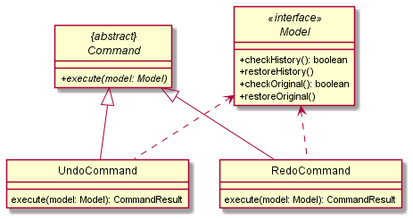

The above class diagram shows the structure of the UndoCommand and RedoCommand and their associated classes and interfaces. Some methods and fields are not included because they are not extensively utilised in UndoCommand and RedoCommand; such as public static fields and getter/setter methods.

#### Interaction between objects when the Undo and Redo Commands are executed

The following sequence diagram shows how the undo operation works:

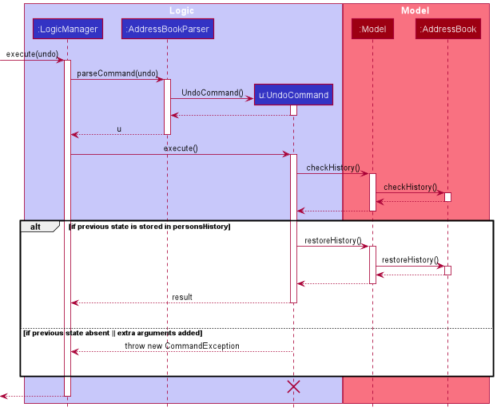

:information_source: **Note:** The lifeline for `UndoCommand` should end at the destroy marker (X) but due to a limitation of PlantUML, the lifeline reaches the end of diagram.

The following sequence diagram shows how the redo operation works:

:information_source: **Note:** The lifeline for `RedoCommand` should end at the destroy marker (X) but due to a limitation of PlantUML, the lifeline reaches the end of diagram.

#### Design considerations:

**Aspect: How undo & redo executes:**

* **Alternative 1 (current choice):** Saves the entire list of persons in the address book.
    * Pros: Easy to implement.
    * Cons: May have performance issues in terms of memory usage.

* **Alternative 2:** Individual command knows how to undo/redo by
  itself.
    * Pros: Will use less memory (e.g. for `delete`, just save the person being deleted).
    * Cons: We must ensure that the implementation of each individual command are correct.

_{more aspects and alternatives to be added}_

### Data archiving feature

In this section, the functionality of the `archive` feature, the expected execution path, the structure of the **ArchiveCommand** class, the structure of the **ArchiveCommandParser** class and the interactions between objects with the **ArchiveCommand** object will be discussed.

#### what is the archive feature

This feature allows the user to save a copy of the working database, which can be then used for archival purposes such as future reference or restore the database back to a working version.

This command will save a copy of the working database at a file path which is dependent on the user's local computer's time and date.
When the user uses this command, a folder named `archive` will be created if it is not yet created at the directory relative to the database file.
Inside this `archive` folder will contain subdirectories named after the user's computer local date in `DDMMYY` format and inside these subdirectories will contain the archived files which is named after the user's computer
local date and time in `DDMMYYHHmmssSSS` format. The reason this format is used is to ensure that all archived files name are unique.

The `archive` command is as follows:
`archive`

#### <ins>How the feature is implemented<ins/>
The archive command will save the archived file into a subdirectory of a directory relative to the address book file path.
`ArchiveCommand#initArchiveFilePath()` will produce the archived file path using the directory path of the address book file as the base directory.
e.g. If the address book file is saved in `ROOT/data`, then a directory called `archive` will be saved in `ROOT/data` and the
subdirectories will be saved as `ROOT/data/DATE` and the archived file path is `ROOT/data/DATE/ARCHIVED_FILE`.
`FileUtil#createIfMissing()` will create a dummy file at the archive file path.
The address book file will then be copied over to this dummy file at the archived file path using `Files#copy()`.

Below are links for implementation of the classes and its methods:
* [`FileUtil`](../src/main/java/seedu/address/commons/util/FileUtil.java)
* [`ArchiveCommand`](../src/main/java/seedu/address/logic/commands/ArchiveCommand.java)
* [`Files#copy()`](https://docs.oracle.com/javase/7/docs/api/java/nio/file/Files.html#copy(java.io.InputStream,%20java.nio.file.Path,%20java.nio.file.CopyOption...))

####**Class Diagram of Archive Feature is shown below:**

The class diagram above depicts the structure of `ArchiveCommand`. As per any `Command` class, `ArchiveCommand` needs to extend the abstract class `Command`.

####**Path Execution of Archive Feature Activity Diagram is shown below:**
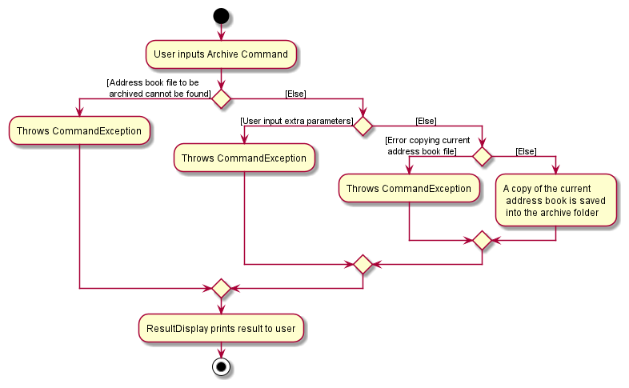

Modelling the workflow of the `Archive` Command, when the user inputs an **Archive Command**, the command is checked if there are any extra parameters. If there is, a `CommandException` will be thrown, else the command then checks if the
working database file to be archived is present. If it is not present, a `CommandException` will be thrown, else the command then proceeds to copy the file. If there is an error copying the file, a `CommandException` will be thrown, else
the archived file will be saved in its respective file path and a success message will be shown to the user.

####**Sequence Diagram of Archive Feature is shown below:**
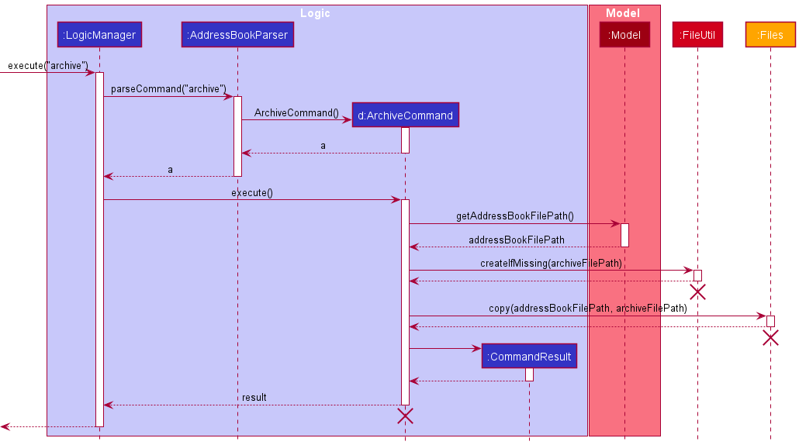

:information_source: **Note:** The lifeline for `ArchiveCommand` should end at the destroy marker (X) but due to a limitation of PlantUML, the lifeline reaches the end of diagram.

The above figure illustrates the important interactions of `ArchiveCommand` when the user successfully archived the current working database file.

When a user inputs `archive`, `LogicManager#execute()` will be invoked and this will trigger a parsing process by `AddressBookParser` to check if there are any extra parameters. If the input is valid, the file path of
the working database file is obtained using `Model#getAddressBookFilePath()`. A dummy copy of the archived file is then created at its file path using `FileUtil#createIfMissing()`, after which the data from the
working database file is copied over to this dummy file using `Files#copy()`. If the archived file is successfully created and copied, the user can then find this file at its file path.

### Resizing result display window feature

In this section, the functionality of the `resize` feature, the expected execution path, the structure of the **ResizeCommand** class and the interactions between objects with the **ResizeCommand** object will be discussed.

#### what is the resize feature
This feature allows the user to resize the result display window in the case they have a small application window size, and/or they want to have a better view at the result feedback text after keying in a command, which is especially true for the `SummariseCommand`
which displays quite a long result feedback text.

The `resize` command is as follows:
`resize 1`

This feature provides the user with three different resizing options to choose from, which are `1`, `2` and `3` with each number being a multiplier of the default result display window size (1 being the default size).

**Class Diagram of Resize Feature is shown below:**
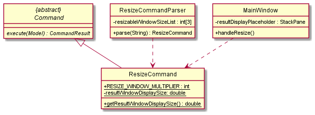

The class diagram above depicts the structure of `ResizeCommand`. As per any `Command` class, `ResizeCommand` needs to extend the abstract class `Command`.

**Path Execution of Resize Feature Activity Diagram is shown below:**

Modelling the workflow of the `Resize` Command, when the user inputs a **Resize Command**, the command is checked if the parameter is valid. If it is invalid, a `ParseException` will be thrown, else the result
display window in the GUI is resized according to the user's option. A success message is then displayed to the user.

**Sequence Diagram of Resize Feature is shown below:**
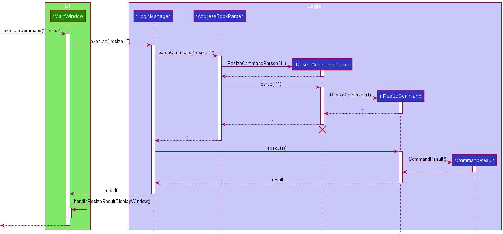

The above figure illustrates the important interactions of `ResizeCommand` when the user successfully resizes the result display window.

:information_source: **Note:** The lifeline for `ResizeCommand` should end at the destroy marker (X) but due to a limitation of PlantUML, the lifeline reaches the end of diagram.

When a user inputs `resize 1`, `MainWindow#executeCommand()` will be invoked which in turn calls `LogicManager#execute()`. This will trigger a parsing process by `AddressBookParser` and `ResizeCommandParser` to check for valid command type and parameters.
This will then create a `ResizeCommand` object which is then executed by the `LogicManager` via `ResizeCommand#execute()` which will then update the value needed to set the result display window size. This value is used by the `MainWindow#handleResizeResultDisplayWindow()`
which sets the window in the GUI according to the user's desired option.

--------------------------------------------------------------------------------------------------------------------

## **Documentation, logging, testing, configuration, dev-ops**

* [Documentation guide](Documentation.md)
* [Testing guide](Testing.md)
* [Logging guide](Logging.md)
* [Configuration guide](Configuration.md)
* [DevOps guide](DevOps.md)

--------------------------------------------------------------------------------------------------------------------

## **Appendix: Requirements**

### Product scope

**Target user profile**:

* has a need to manage a significant number of contacts for contact-tracing of students
* has a simple-to-use product to check on health status of students
* prefer desktop apps over other types
* can type fast
* prefers typing to mouse interactions
* is reasonably comfortable using CLI apps

**Value proposition**:

Keep track of students’ covid status. This is a central repository for covid status updating to ease the facilitation of
management of NUS students across different faculties. It will be easier to read and update covid status.

Every students’ info in one integrated application platform. The app will help to manage students across different
faculties within NUS (no support for other schools).

### User stories

Priorities: High (must have) - `* * *`, Medium (nice to have) - `* *`, Low (unlikely to have) - `*`

| Priority | As a …​                                 | I want to …​                     | So that I can…​                                                |
| -------- | ------------------------------------------ | ------------------------------ | ---------------------------------------------------------------------- |
| `* * *`  | Hall admin                                 | obtain student contact information | quickly contact students if required                               |
| `* * *`  | Hall admin                                 | get a list of students with covid  |  find out any possible hotspots                                    |
| `* * *`  | Hall admin                                 | save the data locally              | for easy dissemination of information to other admins              |
| `* * *`  | Hall admin                                 | find details of a particular student | follow up with checking on the student                           |
| `* * *`  | Hall admin                                 | add a student’s details into the system | store their details for reference                             |
| `* * *`  | First time user                            | add a list of students with their info into the system  | have a centralised hub for covid health status |
| `* * *`  | Hall admin                                 | delete a user from the system      | remove wrongly keyed in inputs from the system                     |
| `* * *`  | Hall admin                                 | clear the system database          | quickly restore the initial state of the system and to start on a clean slate again             |
| `* * *`  | Hall admin                                 | edit a contact’s information       | can modify any change in contact details regarding a user          |
| `* * *`  | Professors                                 | get the statistics of covid cases among different groups of students | can use for further medical research |
| `* *`    | Hall admin                                 | seek help if unfamiliar with Tracey | straighten out any uncertainties regarding the usage of the system |
| `* *`    | Hall admin                                 | easily keep track and update  the covid status of students  | monitor the block that has the highest incidences of Covid-19 |
| `* *`    | Hall admin                                 | store the date when the student tested positive for covid   | check the duration for which the student has to be isolated for                |
| `* *`    | Busy admin                                 | retrieve a list of all email addresses | email them to know their well-being                                           |
| `* *`    | Hall admin                                 | categorise contacts according to faculty | I am happy                                                   |
| `* *`    | Hall admin                                 | filter out those students with covid easily     | plan for hall events   |
| `* *`    | Hall admin                                 | easily export data from the application  | to show my boss                                              |
| `* *`    | UHC people                                 | get the number of students with covid    | prepare enough medical resources accordingly                 |
| `* *`    | Hall admin                                 | easy method to Import data into the app  | save the hassle                                              |
| `* *`    | Hostel Management people                   | retrieve the number of students with covid in the different hostel  | Can plan out the number of rooms for covid use like quarantine etc.                |
| `* *`    | User                                       | have a quick keyword search     | to find a specific person if unsure of his full name or complete contact number                |
| `* `     | Hall leaders                               | get the name of students with covid     | check if their CCA members have Covid                                   |
| `* `     | Residence Fellow                           | know covid status of students and staffs     | come up with hall policies                                   |

### Use cases

(For all use cases below, the **System** is the `Tracey` and the **Actor** is the `user`, unless specified otherwise)

### Use case: UC01 - Delete a student

**MSS**

1.  User requests to list students.
2.  Tracey shows a list of students.
3.  User requests to delete a specific student in the list.
4.  Tracey deletes the person.

    Use case ends.

**Extensions**

* 2a. The list is empty.

  Use case ends.

* 3a. The given index is invalid.

    * 3a1. Tracey shows an error message.

      Use case resumes at step 2.

### Use case: UC02 - Search for a student

**MSS**

1.  User requests to search for student.
2.  Tracey shows the info of student with that matching name.

    Use case ends.

**Extensions**

* 2a. The list does not contain student(s) of that name.

  Use case ends.

* 2b. The given student name exists multiple places on the list.

    * 2b1. Tracey shows a list of students with the name with their info.

      Use case ends.

### Use case: UC03 - Add a student into Tracey

**MSS**

1.  User requests to add the student with his/her details such as year, faculty, covid status.
2.  Tracey adds the student with all his/her details into its database.
3.  Tracey shows the info of student with that matching name.

    Use case ends.

**Extensions**

* 1a. The student info has an invalid format.

    * 1a1. Tracey will inform user that he/she did not provide the correct information.

    * 1a2. User provide the correct details in the correct format.

      Use case ends.

* 1b. The student to be added already exists in the list by Tracey.

    * 1b1. Tracey inform user that the contact exists in her database.

      Use case ends.

* 1c. User adds multiple students in one go.

    * 1c1. Tracey will list out a list of new students added with their info.

      Use case ends.

* 1d. User uses wrong pre-defined constants for fields such as faculty or covid status.

    * 1d1. Tracey will provide a list of pre-defined constants for the user.

      Use case ends.

### Use case: UC04 - Edit information of a student

**MSS**

1.  User requests to list students.
2.  Tracey shows a list of students.
3.  User requests to edit a specific student in the list.
4.  Tracey updates details of the person.

    Use case ends.

**Extensions**

* 1a. The list is empty.

    * 1a1. Tracey shows an empty list.

      Use case ends.

* 2a. The given student name exists multiple places on the list.

    * 2a1. Tracey will inform user that he/she did not provide the information in the correct format.

    * 2a2. User will key in the correct format to edit the student's details.

      Use case ends.

### Use case: UC05 - Clear the system database

**MSS**

1.  User requests to clear all students.
2.  Tracey deletes all students from its database.
3.  Tracey shows an empty list.

    Use case ends.

### Use case: UC06 - Summarize the system database for number of Covid patient

**MSS**

1.  User requests to summarise the number of students with covid.
2.  Tracey shows a pie chart and statements showing the proportion of students with different covid statuses.

    Use case ends.

### Use case: UC07 - List all students

**MSS**

1.  User requests to list all students.
2.  Tracey shows a list of students.

    Use case ends.

**Extensions**

* 1a. The list is empty.
    * 1a1. Tracey shows an empty list.

  Use case ends.

### Use case: UC08 - Request for help from Tracey

**MSS**

1.  User requests Tracey for more details on what she can do.
2.  Tracey redirects user to user guide.

    Use case ends.

**Extensions**

* 2a. The user guide is empty.

  Use case ends.

### Use case: UC09 - Filter a list of students of specified covid status, and/or faculty, and/or block

**MSS**

1. User wants to filter a list of students of a specified covid status, faculty and block.
2. User keys in the details of students to filter out.
3. Tracey returns a list of students of the specified covid status, faculty and block.

   Use case ends.

**Extensions**

* 2a. Tracey detects invalid or empty arguments in user input.
    * 2a1. Tracey displays a error message and shows the correct input format.

      Use case ends.

* 2b. User only inputs details for one or two of the fields (covid status, faculty or block).
    * 2b1. Tracey returns a list of students of the specified details.

      Use case ends.

### Use case: UC10 - Summarise all students for some overview of covid situation

**MSS**

1.  User requests to summarise all students to get how the hall is doing with covid
2.  Tracey shows a pop-up window of pie charts representing the covid situation in each hall block

    Use case ends.

**Extensions**

* 2a. There is no data in database for Tracey to form a helpful response.

  Use case ends.

### Non-Functional Requirements

1.  Application is offered free.
2.  Has storage function
3. Source code is open source
4. The user interface should be intuitive enough for users who are not IT-savvy.
5. Should be compatible with Mac and Windows
6. A record table should be able to have up to 5000 NUS students.
7. the application should work on both 32-bit and 64-bit environments.
8. The application will always answer the user.
9. The application cannot handle image input.
10. The application cannot store 2 or more schools into a instance of application
11. Product is not required to handle printing of reports
12. Product should respond within 10 seconds.

*{More to be added}*

### Glossary

* **Mainstream OS**: Windows, Linux, Unix, OS-X
* **Private contact detail**: A contact detail that is not meant to be shared with others
* **Covid Status**: A student detail that indicates whether the student has Covid-19
* **Health Risk Notice**: Household members living with individuals diagnosed with Covid-19 are issued with this notice
* **Covid-19**: An infectious disease caused by the SARS-CoV-2 virus
* **NUS Hall**: Hall of residence in the National University of Singapore
* **Resident Fellow**: Full-time Academic or Executive & Professional Staff members appointed by the Dean of Students to live in a Hall of Residence
* **Hall leaders**: Student leaders in NUS halls

--------------------------------------------------------------------------------------------------------------------

## **Appendix: Instructions for manual testing**

Given below are instructions to test the app manually.

:information_source: **Note:** These instructions only provide a starting point for testers to work on;
testers are expected to do more *exploratory* testing.

### Launch and shutdown

1. Initial launch

    1. Download the jar file and copy into an empty folder

    1. Double-click the jar file Expected: Shows the GUI with a set of sample contacts. The window size may not be optimum.

1. Saving window preferences

    1. Resize the window to an optimum size. Move the window to a different location. Close the window.

    1. Re-launch the app by double-clicking the jar file. 
       Expected: The most recent window size and location is retained.

1. _{ more test cases …​ }_

### Deleting a person

1. Deleting a person while all persons are being shown

    1. Prerequisites: List all persons using the `list` command. Multiple persons in the list.

    1. Test case: `delete 1` 
       Expected: First contact is deleted from the list. Details of the deleted contact shown in the status message. Timestamp in the status bar is updated.

    1. Test case: `delete 0` 
       Expected: No person is deleted. Error details shown in the status message. Status bar remains the same.

    1. Other incorrect delete commands to try: `delete`, `delete x`, `...` (where x is larger than the list size) 
       Expected: Similar to previous.

1. _{ more test cases …​ }_

### Saving data

1. Dealing with missing/corrupted data files

    1. _{explain how to simulate a missing/corrupted file, and the expected behavior}_

1. _{ more test cases …​ }_
