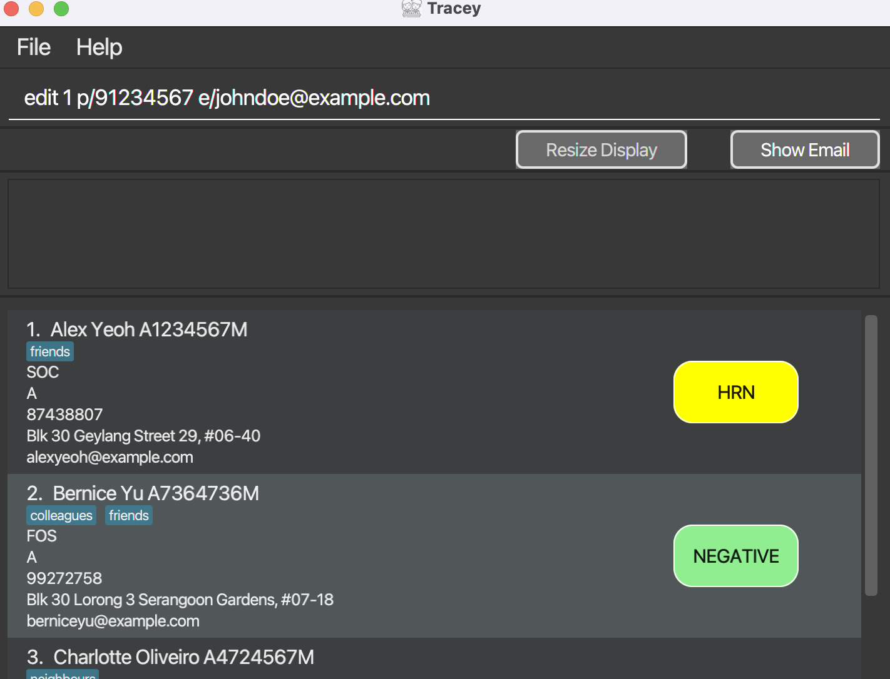
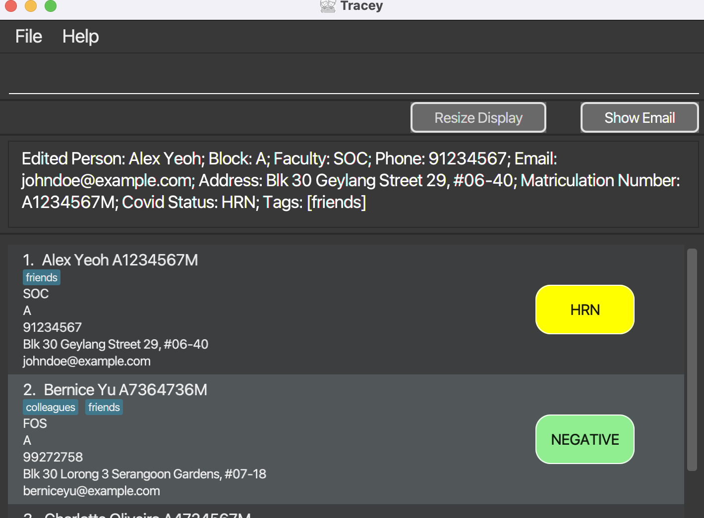
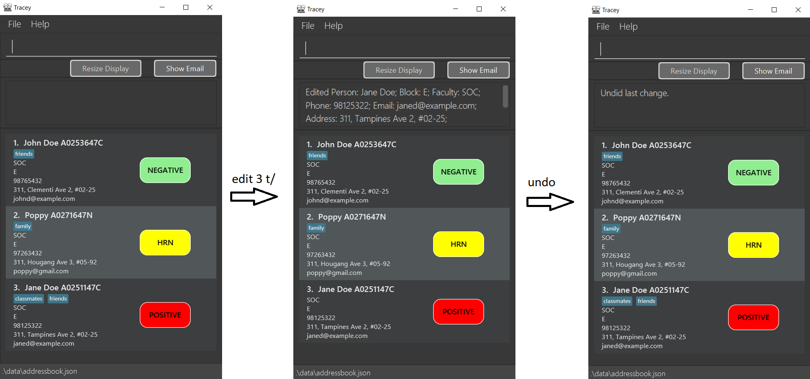
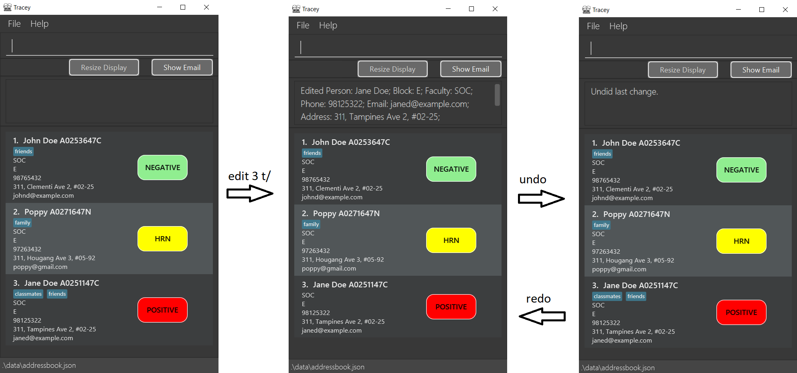
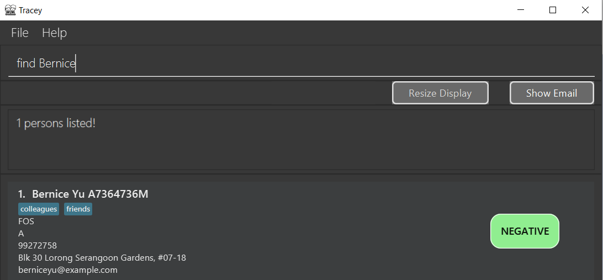
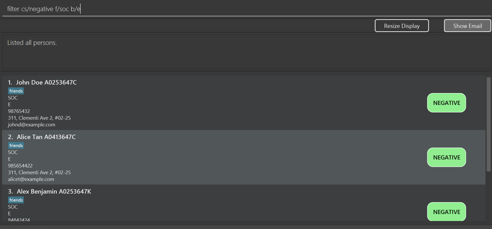
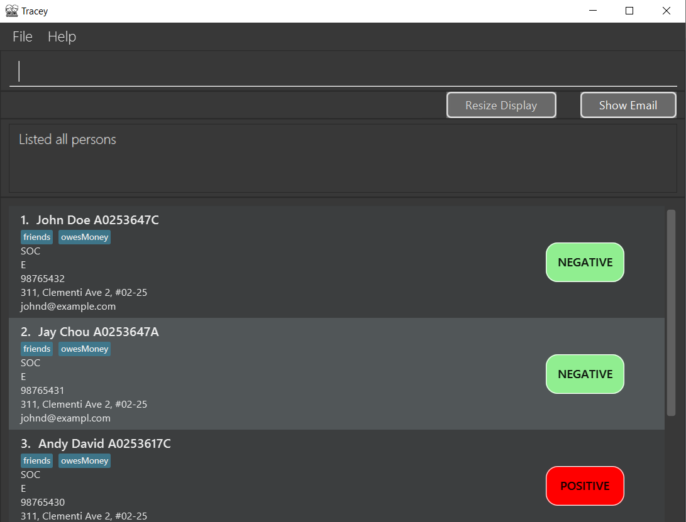

Tracey

Tracey is a **desktop app for managing health statuses of NUS Hall Residents, optimized for use via a Command Line
Interface** (CLI) while still having the benefits of a Graphical User Interface (GUI). If you can type fast,
Tracey can get your student health status management tasks done faster than traditional GUI apps.

What are CLIs? What are GUIs?

##  Brief Introduction

What are CLIs? What are GUIs?

CLIs are Command Line Interfaces. CLIs connect you to a computer program and through the CLI, you can interact with the application by typing in texts (commands).

GUIs are Graphical User Interfaces. GUIs are a system of interactive visual components for computer applications. You can interact with a GUI through a pointing device, such as your mouse.

Note that the main difference between GUI and CLI is the method of interaction.

As Tracey is a Command Line Interface, these are the aspects that highlight the power of Tracey and why it was developed using a CLI:

1. **Speed**  
   Tracey offers immense response speed. GUIs require additional resources to render graphical components, making them slower than CLIs.
2. **Functionality**  
   Tracey offers flexibility in its use. A typical GUI does not have the same level of functionality and granular control as a typical CLI. This is portrayed in the variety of features that Tracey offers, which you can learn about more in this User Guide.
3. **Scalability**  
   Simple command functions in Tracey allows it to handle various complex features. Additionally, the CLI of Tracey allows easier integration of newer features that may be added in future iterations, compared to GUIs which require rendering and creation of graphical components.

This [video](https://www.youtube.com/watch?v=wXzl7e9JGag) illustrates the power of using CLI over GUI in performing the same task.  
(The video is produced by the developers of the FAST app, and has been approved for reuse.)

Sounds exciting? Proceed on to the next section to learn more about Tracey!

We hope you enjoy Tracey as much as we did when developing it!

--------------------------------------------------------------------------------------------------------------------

* Table of Contents 
{:toc}

--------------------------------------------------------------------------------------------------------------------
## 1. How to navigate the User Guide

There are a few symbols to take note of in our User Guide. Their purposes are stated below:

| Symbol  |                                                                            Purpose                                                                             |
|:-------:|:--------------------------------------------------------------------------------------------------------------------------------------------------------------:|
|   :information_source:  |                                Additional notes are parked here. They contain beneficial information in case you are confused.                                 |
|   ⚠️    |            Warnings are parked here. They contain information that you **NEED** to take note of.             |
|   💡    | Tips are parked here. They  highlight certain information that will allow you to fully utilise Tracey.|

*Table 1: Symbols and their purposes.*

Additional formatting guidelines:

|  Format   |                                                                         Purpose                                                                          |
|:---------:|:--------------------------------------------------------------------------------------------------------------------------------------------------------:|
| **Bold**  |                                                        Bolded words indicate important keywords.                                                         |
| `Command` |            Words/phrases that are presented like this highlight specific keywords that you can use to interact with your computer or Tracey.             |
| [Links]() | Words/phrases that are presented like this are clickable links to different parts of the User Guide or to external web pages for additional information. |

*Table 2: Word formats and their purposes.*

--------------------------------------------------------------------------------------------------------------------

## 2. Quick Start
1. Ensure you have Java 11 or above installed in your Computer.

**:information_source: Note:** 

* If you are unsure of which version of Java you are on, follow these steps. Otherwise, continue on from step 2.
    
* To check your java version:
  * For Mac users, open up Terminal and type in `java --version`.
  * For Windows users, open up Command Prompt and type in `java --version`.
  
* If you have the supported version of Java, the response should resemble something like this `java 11.0.9 2020-10-20 LTS`.

* If you do not see the supported version of Java, download Java from this [page](https://www.java.com/en/download/).
  

2. Download the latest **Tracey.jar** from [here](https://github.com/AY2122S2-CS2103T-T12-3/tp/releases).
3. Copy the file to the folder you want to use as the home folder for your Tracey application.
4. Double-click the file to start the app. The GUI, similar to the one below, should appear in a few seconds.
   Note how the app contains some sample data:  
    *Figure 1: Screenshot showing sample data.*

**:information_source: Note:** 
  
* If you are a Mac user and are unable to open the JAR file after double-clicking, please open Terminal and change directory to where **Tracey.jar** is located. Then, type the following command to open the application: `java -jar Tracey.jar`.
  
* If you are a Windows user and are unable to open the JAR file after double-clicking, please open Command Prompt and change directory to where **Tracey.jar** is located. Then, type the following command to open the application: `java -jar Tracey.jar`.
  

5. Type your commands in the command box and press Enter to execute it. e.g. typing **`help`** and pressing Enter will open the help window. 
   Some example commands you can try:

* **`list`** : Lists all contacts.

* **`summarise`** : Summarises all contacts into their respective faculty and informs the reader percentage of student from that faculty is Covid positive.

* **`add n/John Doe b/E f/SoC p/98765432 e/johnd@example.com a/311, Clementi Ave 2, #02-25 mc/A0253647C cs/NEGATIVE t/leader`** : Adds a student named `John Doe` to Tracey.

* **`delete`**`3` : Deletes the 3rd contact shown in the current list.

* **`clear`** : Deletes all contacts.

* **`exit`** : Exits the app.

6. Refer to the [Features](#3-features) below for details of each command.

--------------------------------------------------------------------------------------------------------------------

## 3. Features
### 3.1. Viewing help
Help users to search for all the commands that Tracey offers by opening a pop-up window.
It includes a summary to briefly explain all the commands.
The pop-up window also offers a button for easy access to the User Guide via the user's default browser.

Format: `help`

This is a sample screenshot of what you can expect from the `help` command.

 *Figure 2: Screenshot of help command.*

:bulb: **Tip:** 

* You can also use the `F1` key to open the pop-up window.
  

### 3.2. Adding a contact
Add a student with relevant details such as faculty and Covid status into Tracey.

Format: `add n/NAME b/BLOCK f/FACULTY p/PHONE e/EMAIL a/ADDRESS mc/MATRICULATION_NUMBER cs/COVID_STATUS t/TAGS...`
* Adds a student with the specified details.
* Tags are optional. You can add as many tags as you like.
    * Duplicate tags will be displayed as a single tag.
* The student name is case-sensitive e.g. `add n/johnDoe` will be logged as `johnDoe` and not `JohnDoe` in Tracey.
* Phone Number, email and matriculation number must be **unique** to each student.
* Order of the tags does not matter e.g. `add n/NAME p/PHONENUMBER` is the same as `add p/PHONENUMBER n/NAME`.
* Tracey will acknowledge that the student has been added.
* Values for faculty, Covid status and block need to be of a pre-defined constant as shown in the table below (refer to Table 4 below or in the [glossary](#6-glossary)).
* If any values for faculty, Covid status and block is not one of those defined in the **Pre-defined constants** as described in Table 4, there will be an error. You will have to input the details for the keyword again.
* If you added duplicate `n/`, `p/`, `e/`, `a/`, `f/`, `mc/`, `cs/` or `b/` prefixes, Tracey will record the latest of the duplicates.  
  i.e. `add e/student69@u.nus.edu n/Martin b/e f/fol e/martiniser@gmail.com p/98090042 a/74 Pasir Ris Avenue mc/a1223213h cs/positive` is the same as `add n/Martin b/e f/fol e/martiniser@gmail.com p/98090042 a/74 Pasir Ris Avenue mc/a1223213h cs/positive`.

Examples of usage:
* `add n/Melvin b/c f/SOC p/84440808 e/melvin@nus.edu.sg a/12 Kent Ridge Drive mc/a0211343z cs/Negative`
* `add n/Martin b/e f/fol e/martiniser@gmail.com p/98090042 a/74 Pasir Ris Avenue mc/a1223213h cs/positive t/level2`

| Correct Usage :white_check_mark: | Incorrect Usage  :x: |
|:--------------------:|:-----------------:|
|     cs/Negative      | cs/Close-contact  |
|        f/SoC         |      f/SooC       |

*Table 3: Incorrect usage of **pre-defined constants**. Refer to Table 4 for an exhaustive list of such constants.*

| **Prefix** | **Meaning** |    **Pre-defined constants**                                                                          |                                                                                                                                                                                                                                                        Constraints                                                                                                                                                                                                                                                        |
|:-----:|:--------------------:|:-------------------------------------------------------------------------------------------------:|:-------------------------------------------------------------------------------------------------------------------------------------------------------------------------------------------------------------------------------------------------------------------------------------------------------------------------------------------------------------------------------------------------------------------------------------------------------------------------------------------------------------------------:|
| `n/`  | Name                 | None                                                                                                  |                                                                                                                                                                                                                 Can only contain alphanumeric characters and spaces. Must be no more than 60 characters.                                                                                                                                                                                                                  |
| `p/`  | Phone Number         | None                                                                                                  |                                                                                                                                                                                                                                        Can only be numbers at least 3 digits long.                                                                                                                                                                                                                                        |
| `e/`  | Email                | None                                                                                                  | An email address should begin with a local part containing alphanumeric characters and these special characters: `+_.-`. The local part cannot start with a special character. This should be followed by a '@' and then a domain name.  The domain name should be made up of domain labels separated by periods, and must end with a domain label at least 2 characters long and each domain label can only consist of alphanumeric characters, separated only by hyphens, if any. |
| `a/`  | Address              | None                                                                                                  |                                                                                                                                                                                                                                                     Cannot be blank.                                                                                                                                                                                                                                                      |
| `f/`  | Faculty              | `FASS` `BIZ` `SOC` `SCALE` `FOD` `CDE` `DUKE` `FOL` `YLLSOM` `YSTCOM` `SOPP` `LKYSPP` `SPH` `FOS` |                                                                                                                                                                                                                          Can only be one of the pre-defined constants, and is case-insensitive.                                                                                                                                                                                                                           |
| `mc/` | Matriculation Number | None                                                                                                  |                                                                                                                                                                                                                          Can only start with an "A", followed by 7 digits, ending with a letter.                                                                                                                                                                                                                          |
| `cs/` | Covid Status         | `Positive` `Negative` `HRN`                                                                       |                                                                                                                                                                                                                          Can only be one of the pre-defined constants, and is case-insensitive.                                                                                                                                                                                                                           |
| `b/`  | Block                | `A` `B` `C` `D` `E`                                                                               |                                                                                                                                                                                                                          Can only be one of the pre-defined constants, and is case-insensitive.                                                                                                                                                                                                                           |
| `t/`  | Optional tag(s)      | None                                                                                                  |                                                                                                                                                                                                                 Can only contain alphanumeric characters and spaces. Must be no more than 30 characters.                                                                                                                                                                                                                 |

*Table 4: Table showing list of possible prefixes and the Pre-defined constants.*

As described in Table 4, these are the possible prefixes that can be used with Tracey. E.g `n/`, `cs/` etc.
In addition, the list of pre-defined constants are also provided for `Faculty`, `Covid Status`, and `Block`.

:bulb: **Tip:** 
  
* You are able to add optional tags with no restrictions using the `t/` prefix.
  
* Additions can be reversed with the `undo` feature.
  

### 3.3. Editing an existing contact
Edit a contact at a specific index.

Format: `edit INDEX n/NAME ...`
* Edits an existing student's information found in Tracey. The student is referred to by an index, displayed beside his/her name in the student list.
* To edit a student's details, you can use the command `edit` with the student's `INDEX` and the corresponding field prefix (mentioned in Figure 3 above).
  The index **must be a positive integer** 1, 2, 3, …
* The correct prefixes must be used in order for Tracey to know what you intend to edit.
* Refer to Table 4 in the [glossary](#6-glossary) for the correct format and pre-defined constants to be used for each input field.
* Existing information of the student will be replaced with the newly inputted values.
* When editing tags, all existing tags will be replaced with the newly inputted tag(s).  
  i.e. Adding tags is not cumulative. All new tags will replace all old tags.
* You can remove all tags of the student by typing `t/` without specifying any details after it.
* If you have included duplicate `n/`, `p/`, `e/`, `a/`, `f/`, `mc/`, `cs/` or `b/` prefixes, Tracey will record the latest of the duplicates.  
  i.e. `edit 1 p/98090042 p/81812424` is the same as `edit 1 p/81812424`.

How to identify `INDEX`:
 *Figure 3: Screenshot of index location.*

Examples of usage:
* `edit 2 n/David Limpeh t/` edits the entry to become `David Limpeh` and clears all existing tags.
* `edit 1 p/91234567 e/johndoe@example.com` edits the phone number and email address of the 1st student to be `91234567`
  and `johndoe@example.com` respectively.

Original list:
 *Figure 4: Screenshot of Tracey before edit command is applied.*

Result of applying `edit 1 p/91234567 e/johndoe@example.com`:
 *Figure 5: Screenshot of Tracey after applying the edit command.*

:information_source: **Note:** 
  
* Tracey shows the entire edited database after the edit command is applied.

* After every edit command, the student at the specified index will be shifted to the bottom of the list.

* If the input phone number, matriculation number, or email address is already in the address book, Tracey will show an error message saying "This person already exists in the address book."

  
:bulb: **Tip:** 
  
* Edits can be reversed with the `undo` feature.
  

### 3.4. Deleting a contact
Delete a contact at a specific index.

Format: `delete INDEX`
* Deletes an existing student in Tracey. The student is referred to by an index, displayed beside his/her name in the student list.
* To delete a student, you can use the command `delete` on the student's `INDEX`.
  The index **must be a positive integer** 1, 2, 3, …
* Deletes one student at a time.
* You can only delete the contact information at an index where there is a student assigned to it.

How to identify `INDEX`:
 *Figure 6: Screenshot of index location.*

Examples of usage:
* `delete 2` removes the 2nd student on the list.
* `delete 10` removes the 10th student on the list.

:bulb: **Tip:** 
  
* The `INDEX` used for each student is not fixed. It depends on the number shown on the displayed list of students.
  
* You can use `find` to get his/her `INDEX` and then apply `delete`.

* This can save you time scrolling down an entire list to get his/her `INDEX`!
  
* Deletions can be reversed with the `undo` feature.
  

### 3.5. Undoing an action
Undo an executed `add`, `edit` or `delete` command.

Format: `undo`
* Undoes only the last executed add, edit or delete command.
* You can only use the `undo` command after executing an add, edit, or delete command.
* Cannot be used in succession to undo previously executed commands besides the last executed one.

Examples of usage:
* Using `undo` after an `add` command will remove the recently added student.
* Using `undo` after an `edit` command will restore the details of the student back to his/her previous state.
* Using `undo` after a `delete` command will add the recently deleted student.

Scenario for undoing an edit command:
 *Figure 7: Scenario of using an undo command following an edit command.*

Figure *7* depicts a scenario in which an `undo` command is used to restore any previous changes made to a student using the `edit` command. Let's say you want to remove the tags for Jane Doe who is at index 3. 
The command `edit 3 t/` will remove all tags from Jane Doe. However, you then changed your mind in removing all tags from Jane Doe. You can then use the `undo` command to restore all tags for Jane Doe.

:information_source: **Note:** 
  
* After using an `undo` command successfully, you cannot use an `undo` command following that `undo` command.
  
* Using an `undo` command after an `edit` command will not restore the student's index back to his/her original index.
  
   * If the student's original index is 1, using an `edit` command will place him/her at the last index of Tracey.
  
   * Using an `undo` command will not restore the student's index back to 1.
  

### 3.6. Redoing an action

Reverse an executed undo command.

Format: `redo`
* Reverses only the last executed `undo` command.
* You can only use the `redo` command after executing an `undo` command.
* Cannot be used in succession to reverse previously executed `undo` commands besides the last executed one.

Examples of usage:
* Using `redo` after using `undo` on an `add` command will counteract the effect of undoing an `add` command and the overall result adds a student into Tracey.
* Using `redo` after using `undo` on a `delete` command will counteract the effect of undoing a `delete` command and the overall result deletes the student from Tracey.
* Using `redo` after using `undo` on an `edit` command will counteract the effect of undoing an `edit` command and the overall result edits the details of the student in Tracey.

Scenario for redoing after undoing an edit command:
 *Figure 8: Scenario of using a redo command after using an undo command following an edit command.*

Following the scenario from *Figure 7*, *Figure 8* depicts the scenario in which you have decided once again to change your mind and remove the tags for Jane Doe. You can use the `redo` command
to counteract the effects of the `undo` command on the `edit` command, and to counteract the effects of the undo command. At the end, all tags will be removed from Jane Doe.

:information_source: **Note:**  
  
* After using an `redo` command successfully, you cannot use a `redo` command following that `redo` command.
  
* Using a `redo` command after an `undo` command on an `edit` command will not restore the student's index back to his/her original index.
  
  * If the student's original index is 1, using an `edit` command will place him/her at the last index of Tracey.
  
  * Using a `redo` command after using an `undo` command will not restore the student's index back to 1.
  

### 3.7. Finding a contact
Find a student in Tracey using the student's full or partial name to retrieve their specific details.

Format: `find NAME`
* Returns the student(s) whose name(s) contain the input keyword `NAME` with their **details**.
* A list of students will be returned along with their **details** including their `Name`, `Matriculation Number`, `Faculty`, `Block`, `Phone`, `Address`, `Email` and `Covid Status`.
* The search is case-insensitive. e.g. `johnDoe` will match `Johndoe`.
* The input keyword does not need to be a full name. e.g. `jo` will match `Joe` and `John`.
* Following the previous point, the input should contain the initial letters of the name. e.g. `jo` or`joh` for John. Conversely, if a user inputs `ohn` for John, this will not warrant the correct result. 

Examples of usages:
* `find John` returns `john` and `John Doe`.
* `find alex david` returns `Alex Yeoh` and`David Li`.
* `find J` returns `john` and`jay`.

Scenario:
 *Figure 9: Screenshot of result of the find command.*

As seen in the *Figure 9*, after the user keys in `find Bernice`, the application returns Bernice's details: `Name`, `Matriculation Number`, `Faculty`, `Block`, `Phone`, `Address`, `Email` amd `Covid Status`.

### 3.8. Filtering contacts
Filter students based on faculties, health statuses and/or blocks.

Format:`filter f/FACULTY cs/COVID_STATUS b/BLOCK`

* Returns a list of students that fit the criteria given by the user in the form of pre-defined constants in the categories of faculty, covid status and block.
* Refer to Table 4 in the [glossary](#6-glossary) for the list of pre-defined constants to be used for these 3 categories.
* The search is case-insensitive. e.g. `Positive` will match `positive`.
* The order of fields specified does not matter e.g. `filter f/soc cs/positive` and `filter cs/positive f/soc` will return the same result.
* At least one field has to be specified, but not all need to be e.g. `filter` is invalid, but `filter b/A` is valid.

Examples of usage:
* `filter cs/positive` returns all students that are tagged as covid-positive.
* `filter f/soc` returns all students that are enrolled in the faculty SOC (School of Computing).
* `filter b/e` returns all students who live in block E of the hall.
* `filter cs/negative f/soc` returns all students that are tagged as covid-negative and enrolled in the faculty SOC (School of Computing).
* `filter cs/negative f/soc b/e` returns all students that are tagged as covid-negative, enrolled in the faculty SOC (School of Computing) and live in block E of the hall.

An example is shown below:
 *Figure 10: Example result of filter command.*

As seen in *Figure 10*, using the `filter` command with "negative" as covid status, "soc" as faculty and "e" as block will return a list of contacts matching these criteria.

:information_source: **Note:** 
  
* `filter` command only allows you to search via faculty, health status and block. To search for contacts whose names contain a keyword, use the `find` command instead.
  

### 3.9. Listing the records
List all students, displaying all their data stored in Tracey.

Format: `list`

This is a sample screenshot of what you can expect from the `list` command.

 *Figure 11: Screenshot of list command.*

### 3.10. Copying emails
Open up a separate window that consists of all the emails of the current displayed students.

Format:`email`

 *Figure 12: Screenshot of Copy Email function.*

From *Figure 12*, this function is beneficial for administrators as you may want to contact this particular list of students. Simply click `Copy Email` and you can go to the email platform of your choice and paste this in the Address section. This function definitely faster than individually copy-pasting student emails.

:information_source: **Note:** 
  
* There is also a `Show Email` button on the GUI which you can click to open the same window.
  
* On the window, there will be a `Copy Email` button that copies the list of emails to the user's clipboard to allow the user to efficiently send out mass emails. This function definitely is faster than individually copy-pasting student emails.
  

### 3.11. Summarising the records
The above figure illustrates the important interactions of `EditCommand` when the user successfully edit the `name` attribute of the student at index 1 to Poppy.

When a user inputs an `EditCommand`, `LogicManager#execute()` will be invoked and this will trigger a parsing process by `AddressBookParser`, `EditCommandParser` and `ParserUtil` to check the validity of the input index, prefixes and parameters. If the input is valid, a `EditPersonDescriptor` object is instantiated and this object is subsequently used as a parameter to instantiate an `EditCommand` object.
The `EditCommand` object is then passed back to the `LogicManager` which will then invoked `EditCommand#execute()`. This execute method will call two other helper methods `EditCommand#editChecker()` and `Person#isDifferentPerson()`, which both are not shown in the sequence diagram and is used further validation.
The main functions of these two methods are to check if the new values are duplicate of the corresponding fields to be edited and if the new values for fields that requires uniqueness already exists in the address book respectively.
The `ObservableList` in the `Model` class then updates the display of the contacts, placing the edited person to the bottom of the list (or placing it at the last index).

TThe `ObservableList` is a JavaFX class which observes and automatically changes the list once an update is performed.

Summarise the statistics of the student records inside Tracey.

Format:`summarise`
* You can get an overview of the students in Tracey if you want to get an idea of the hall block or faculty where Covid is more prevalent.
* You can see which hall block or faculty has the highest number of Covid cases.

Example of usage:
* `summarise` will summarise the records of everyone in Tracey. The results is a graphical analysis of the `Covid Status` of the individuals in each block. Additionally, an overview of the `Covid Status` of the Hall population is also provided (refer to figure 4).

 

*Figure 13a: Example pie charts of Tracey in response to the `summarise` command.* 

 

*Figure 13b: Example bar chart of Tracey in response to the `summarise` command.*

From *Figure 13a and 13b*, when the user inputs the `Summarise` command, the results are multiple charts of the proportion of the student population categorised by `Covid Status`. These charts are separated into the student `Blocks` and the wider hall population.

### 3.12. Archiving Tracey
Archive the current Tracey database. The archived database will be saved in `ROOT/data/archive/DIRECTORY/ARCHIVED_FILE` where:
* `ROOT`: The folder where the Tracey.jar is in.
* `DIRECTORY`: Archived file directory named using your local PC's date in the format of DDMMYY.
  * The day is abbreviated as DD, the month is abbreviated as MM and the last two digit of the year is abbreviated as YY.
* `ARCHIVED_FILE`: Archived file name named using your local PC's date and time in the format of DDMMYY_HHmmssSSS which is stored as a `json` file.
  * The hour is abbreviated as HH, the minute is abbreviated as mm, the seconds is abbreviated as ss and the milliseconds is abbreviated as SSS.

Format: `archive`

Examples of usage:
* Given the current date and time on your local PC in which the `archive` command is used: 27/03/2022 (DD/MM/YYYY) 15:28:33:123 (HH:mm:ss:SSS in 24-hour notation).
  * The archived file will be saved **in** `ROOT/data/archive/270322`.
  * The archived file will be saved **as** `270322_152833123.json`. (`json` is the suffix (after the period) to indicate the file type)
  * The file path will be `ROOT/data/archive/270322/270322_152833123.json`.
* To retrieve your archived file:
  1. Open the folder in which your Tracey.jar is stored in.
  2. Open the folder named `data`.
  3. Open the folder named `archive`.
  4. Open the folder named `270322`.
  5. Your archived file is named `270322_152833123.json`.

:warning: **Warning:** 
  
* Do not change the suffix of the archived file to any other type except for `json` as only a `json` file is compatiable with Tracey.

* Do not manually edit the database file i.e. edit directly from `addressbook.json`, as this feature will save an exact copy of it regardless of whether it is corrupted or not.
  

:bulb: **Tip:** 
  
* You can rename the archived file in the file path manually for easier reference.
  
   * Features for naming the archived file using the CLI will be available in later releases.
  
   * To restore Tracey to a previous version, rename the archived file name to `addressbook.json` and replace the file in `ROOT/data` with the archived file.
  

### 3.13. Resizing the result display window
Resizes the result display window to 3 pre-set sizes.

Format: `resize SIZE`
* There are only 3 options for `SIZE` which are 1, 2 and 3.
* The default result display window size is option 1.
* Refer to Figure 14 for the comparison for the different result display window sizes.

 *Figure 14: Comparison of the 3 different resizing options for the result display window.* 

:information_source: **Note:** 
  
* There is also a `Resize Display` button on the GUI which you can click to cycle between the 3 different resizing options.
  

 

:bulb: **Tip:** 

* This feature is especially useful if you need a bigger result display window size to better view the result feedback given by Tracey, especially if the result feedback is long.

### 3.14. Clearing all records
Clear all the data inside Tracey.

Format:`clear`

:warning: **Warning:** 
  
* Use the `archive` feature to save a copy of the data file if you intend to keep it as the deleted files cannot be recovered.
  
* This feature cannot be reversed using `undo`.
  

### 3.15. Exiting Tracey
Close the application.

Format: `exit`
* Closes the application.

### 3.16. Saving
Saving in the application is automatic. The data in the file will be saved accordingly whenever
there are changes to Tracey.

---------------------------------------------------------------------------------------------------------------

## 4. FAQ
1. **Q**: How do I transfer my data to another computer?  
   **A**: Copy the file from [ROOT]/data/addressbook.json over to your other computer.  

2. **Q**: What is the difference between the `list` command and `summarise` command?  
   **A**: The main differences of `list` and `summarise` are:

        a. The `list` command will provide an unfiltered list of students `summarise` command will tabulate the students into pie charts according to the block they stay in and faculty they belong to.

        b. `list` is helpful to get a bird eye view of the details of all the students whereas `summarise` is great to analyse how certain areas in the hall compound is doing.

        c. `list` is optimal to find a particular student out of everyone while `summarise` is optimal to find which block is dealing not-so-well with the covid outbreak.

3. **Q**: Can I use filter using keywords to find certain people in the list of students?  
   **A**: Unfortunately `filter` command only allows you to search via the tags such as `positive`, `soc` and block `A`. Please use the `find` command instead which will allow you to search via keywords.  

4. **Q**: Where can I find the `INDEX` of a student?  
   **A**: They can be found in the numbers located beside each individual student.  
    *Figure 6: Screenshot of index location.*

5. **Q**: The `delete` feature only allow me to delete via the `INDEX` assigned to each particular student. How do I know the `INDEX` of the student I want to use `delete` on?  
   **A**: The `INDEX` used for `delete` is not fixed. It relies on the number in which the displayed list of students will assign.
   You can use `find` `STUDENT` to get his/her `INDEX` and then apply `delete`. This can save you time scrolling down an entire list to get his/her `INDEX`!  

6. **Q**: The `edit` feature only allow me to edit via the `INDEX` assigned to each particular student. How do I know the `INDEX` of the student I want to use `edit` on?  
   **A**: The `INDEX` used for `edit` is not fixed. It relies on the number in which the displayed list of students will assign.
   You can use `find` `STUDENT` to get his/her `INDEX` and then apply `edit`. This can save you time scrolling down an entire list to get his/her `INDEX`!  

7. **Q**: Can I create new tags not mentioned by the app?  
   **A**: Yes! You are able to add optional tags with no restrictions using the `t/` prefix.

--------------------------------------------------------------------------------------------------------------------

## 5. Command Summary

*Table 5: Command Summary.*

| No. | Command     | Description                                                                               | Example                                                                                                                                |
|-----|-------------|-------------------------------------------------------------------------------------------|----------------------------------------------------------------------------------------------------------------------------------------|
| 1.  | `help`      | In-app support to understand how the commands work in Tracey                              | `help`                                                                                                                                 |
| 2.  | `add`       | Add a student to the Tracey Database                                                      | `add n/John Doe b/E f/SoC p/98765432 e/johnd@example.com a/311, Clementi Ave 2, #02-25 mc/A0253647C cs/NEGATIVE t/friends`             |
| 3.  | `edit`      | Change particulars of a student                                                           | `edit 1 p/91234567 e/johndoe@example.com`                                                                                              |
| 4.  | `delete`    | Remove a student from Tracey                                                              | `delete 2`                                                                                                                             |
| 5.  | `undo`      | Undo a `add`, `edit` or `delete` command                                                  | `undo`                                                                                                                                 |
| 6.  | `redo`      | Reverse an `undo` command                                                                 | `redo`                                                                                                                                 |
| 7.  | `find`      | Find a particular student                                                                 | `find alex`   `find j`                                                                                                              |
| 8.  | `filter`    | Retrieve list of people based on tags                                                     | `filter cs/positive f/soc b/e`                                                                                                         |
| 9.  | `list`      | Get a list of everyone in Tracey                                                          | `list`                                                                                                                                 |
| 10. | `email`     | Opens a window of all student's in the current list which can be copied to your clipboard | `email`                                                                                                                                |
| 11. | `summarise` | Summarise data into a list and pie charts for an overview                                 | `summarise`                                                                                                                            |
| 12. | `archive`   | Archives the Tracey Database                                                              | `archive`                                                                                                                              |
| 13. | `clear`     | Format the Tracey Database                                                                | `clear`                                                                                                                                |
| 14. | `resize`    | Resizes the result display window                                                         | `resize 1`                                                                                                                             |
| 15. | `exit`      | Closes the application                                                                    | `exit`                                                                                                                                 |

--------------------------------------------------------------------------------------------------------------------

## 6. Glossary

*Table 4: List of prefixes, fields, pre-defined constants and constraints.*

| **Prefix** | **Meaning** |    **Pre-defined constants**                                                                              | Constraints                                                             |
|:-----:|:--------------------:|:-----------------------------------------------------------------------------------------------------:|:-----------------------------------------------------------------------:|
| `n/`  | Name                 | None                                                                                                  | Can only contain alphanumeric characters and spaces.                    |
| `p/`  | Phone Number         | None                                                                                                  | Can only be numbers at least 3 digits long.                             |
| `e/`  | Email                | None                                                                                                  | An email address should begin with a local part containing alphanumeric characters and these special characters: `+_.-`. The local part cannot start with a special character. This should be followed by a '@' and then a domain name.  The domain name should be made up of domain labels separated by periods, and must end with a domain label at least 2 characters long and each domain label can only consist of alphanumeric characters, separated only by hyphens, if any. |
| `a/`  | Address              | None                                                                                                  | Cannot be blank.                                                        |
| `f/`  | Faculty              | `FASS` `BIZ` `SOC` `SCALE` `FOD` `CDE` `DUKE` `FOL` `YLLSOM` `YSTCOM` `SOPP` `LKYSPP` `SPH` `FOS`     | Can only be one of the pre-defined constants, and is case-insensitive.  |
| `mc/` | Matriculation Number | None                                                                                                  | Can only start with an "A", followed by 7 digits, ending with a letter. |
| `cs/` | Covid Status         | `Positive` `Negative` `HRN`                                                                       | Can only be one of the pre-defined constants, and is case-insensitive. |
| `b/`  | Block                | `A` `B` `C` `D` `E`                                                                               | Can only be one of the pre-defined constants, and is case-insensitive. |
| `t/`  | Optional tag(s)      | None                                                                                                  | Can only contain alphanumeric characters and spaces. Must be no more than 30 characters. |

*Table 6: Specific terminology used.*

| Term                                | Meaning                                                                                                                                                                                                                                                                                             |
|-------------------------------------|-----------------------------------------------------------------------------------------------------------------------------------------------------------------------------------------------------------------------------------------------------------------------------------------------------|
| Block                               | The building or demarcated area within a residential hall that a student resides in. Typically, A residential hall is separated into 5 blocks: A, B, C, D and E.                                                                                                                                    |
| Command Line Interface (CLI)        | A text-based user interface used to run applications.                                                                                                                                                                                                                                               |
| Covid Status                        | A status to indicate whether a person is Covid-positive or has a has a health risk notice (HRN).                                                                                                                                                                                                    |
| Faculty                             | A group of departments in a university with a major division of knowledge. E.g. The School of Computing (SOC).                                                                                                                                                                                      |
| Graphical User Interface (GUI)      | A system of interactive visual components used for managing user interaction with an application.                                                                                                                                                                                                   |
| Health Risk Notice (HRN)            | A label on a person to indicate that he/she has been identified as a close contact or household member of a Covid positive case.                                                                                                                                                                    |
| JAR File                            | JAR stands for **J**ava **AR**chive. This is a cross-platform file archive format that combines and compresses a large number of files into one, handling class files, audio and image files.                                                                                                       |
| Matriculation Number                | A student's unique identification number; also known as Student ID.                                                                                                                                                                                                                                 |
| Prefix                              | A set of one or more characters placed before others. When using Tracey, one or more letters followed by a forward slash (e.g. `cs/`) is used as a prefix to a detail to be input. The set of prefixes used by Tracey is shown in table 3 under <a href='#adding-a-contact'>"Adding a contact"</a>. |
| Pre-defined constant                | Specific values that certain fields can only take. E.g. The pre-defined constants for Covid Status are `Positive`, `Negative` and `HRN`. Thus, these are the only values that can be input with the Covid Status prefix. Any other values would result in an error.                                 |
| Uniform Resource Locator (URL)      | A reference to a web resource specifying its location in a computer network and the mechanism for its retrieval; more commonly known as a web address.                                                                                                                                              |
| JavaScript Object Notation (JSON)   | A text format used for transmitting data. It stores and transmit data objects consisting of attribute-value pairs and array (or other serialisable values), and the text used is human-readable.                                                                                                    |
